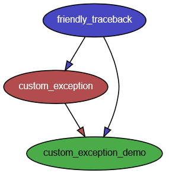
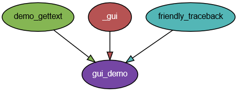
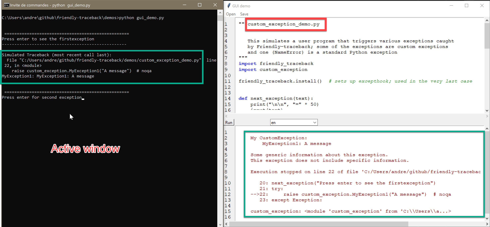
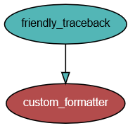

Description of demos
=====================

.. note::

    Read the following if you are interested in making use of Friendly-traceback
    in your own project, perhaps adding your own exceptions, or wanting to
    change the formatting.

In the `demos <https://github.com/aroberge/friendly-traceback/tree/master/demos>`_ directory, 
there are a few different files, including the following.

custom_exception.py
--------------------

Shows how to define custom exceptions that are ready to be used by
Friendly-traceback. While this is not required, we show how to
support translations.

There is no point in running this file as a script.

custom_exception_demo.py
------------------------

This is a demo that generates a few exceptions (most of which are imported
from custom_exception.py), process them with Friendly-traceback, and
shows the result.

This script can be run from a command line.

gui_demo.py
-----------

This is a demo GUI that should be run from a command line.

After starting this GUI demo, which does nothing on its own,
I suggest that you use the menu to open "custom_exception_demo.py" and run it; you
will need to interact from the console (command line) as if you were executing
that script from Python.

The "simulated" Python traceback is shown in the console on the left; the program
pause periodically and ask the user to proceed to the next example.

On the right, we can see the file "custom_exception_demo.py" loaded in
the editor at the top; at the bottom, we see the custom exception information.

Note that this GUI could likely be significantly improved; it is included
only as a proof of concept.
Experienced GUI programmers should feel most welcome to contribute their
expertise and make this a more user-friendly demonstration.

custom_formatter.py
-------------------

A custom formatter which creates an html file from a given exception.

Running this custom formatter will produce the following *ugly* html output
(additional border added "by hand" here).

.. raw:: html

    
    

    <h2 class="main">Python exception:</h2>
    <h4 class="main">NameError: name 'a' is not defined</h4>
    <h3 class="sub">Likely cause:</h3>
    
In your program, the unknown name is 'a'.
    

    <h4 class="main">Execution stopped on line 72 of file 'custom_formatter.py'.
    <h4>
    <pre class="pre2">       70:
           71: try:
        -->72:     b = a + c  # noqa
           73: except Exception:
    </pre>
    

demo_gettext.py
----------------

Provides translation support for the demos

Additional file: ``_gui.py``
----------------------------

Various GUI elements that do not depend on either `demo_gettext.py` or
`friendly_traceback` and would only clutter the code of demos if they were
included in the script to be run.

Acknowledgement
----------------

Note that the information obtained by Friendly-traceback is collected
in a "structured" form, as suggested by Aivar Annamaa
in Issue8_ and noted in Issue10_,
so that it could be formatted differently by any program using Friendly-traceback.

.. _Issue8: https://github.com/aroberge/friendly-traceback/issues/8
.. _Issue10: https://github.com/aroberge/friendly-traceback/issues/10
