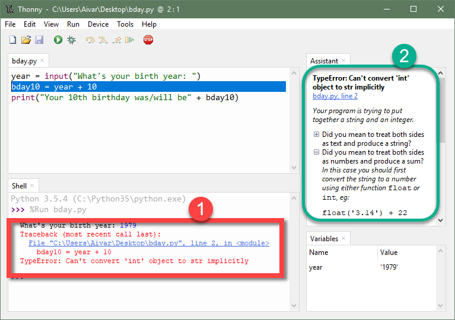
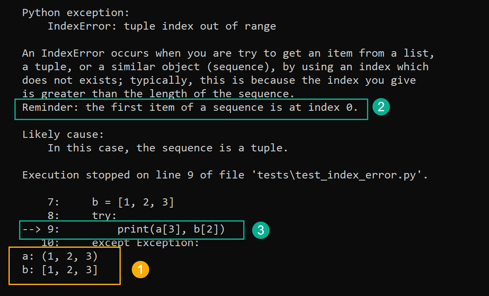
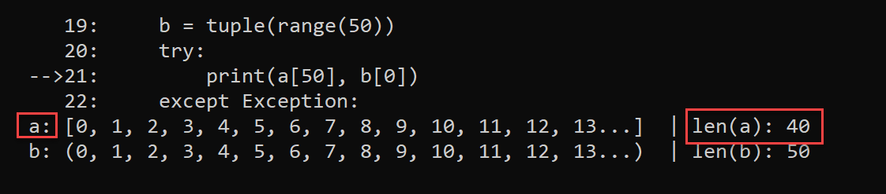
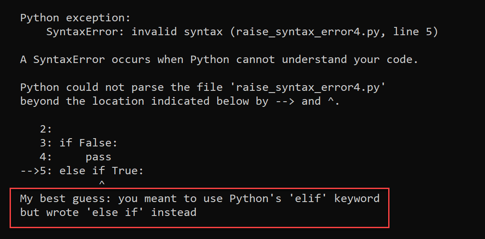

Some thoughts on the design of friendly
=================================================

The following are thoughts on the design of this project.
The content of this file **will** be changed as this project evolve.

Original purpose
------------------

friendly's primary purpose is to make it easier for
beginners and/or for people that have limited knowledge of English
to understand what caused a program to generate a traceback.

A secondary goal is to help them learn how to decipher a normal Python
traceback and use the information **provided by Python**
to understand what went wrong and how to fix it.

Revised purpose
----------------

As friendly was developed, we found that going beyond
providing an explanation for the traceback printed by Python
was potentially very useful. This is something that is currently
done by Thonny_ which, in some cases, even attempts to identify more than
one possible cause giving rise to an exception, as well as ordering them
in order of likelihood, based on its own analysis of the code.

.. _Thonny: https://thonny.org/

As a concrete example, in the image below,
Thonny shows the normal Python traceback [1],
and offers some additional explanations [2], parts of which can be hidden
or revealed by clicking on a button.

For now, friendly tries to identify the most likely cause
of the exception, but some consideration has been given to
include more than one possible explanation in some cases.

Gradual reveal
---------------

Initially, it was thought that the information provided by friendly
should be shown all at once. As we accumulated more and more cases,
we realised that this could yield a huge amount of material which could
be rather daunting for beginners. Eventually, this lead to the
approach of using a REPL whenever possible so that the user could get
some small amount of information at a time by entering ``why()`` or
``where()``.

As part of the gradual reveal, the traceback shown to the user
shows an added "hint" which attempts to summarize in a single sentence
a possible cause or remedy to the exception that was raised.
This has been inspired in parts by the
`DidYouMean-Python (aka BetterErrorMessages) <https://github.com/SylvainDe/DidYouMean-Python>`_
project.

About Warnings
---------------

In addition to generating exceptions, Python can provide some Warnings
to users. For now, these are simply silenced but we would like to
consider including them in the information provided by
friendly.

Location of the exception
--------------------------

While a Python traceback includes the information from all the frames
that were involved, friendly focus on the first and last frame,
as these are more likely to contain the relevant information to the user.

Variable information
---------------------

.. sidebar:: Very old version!

    The screenshots on this page have been done with a very old
    version of friendly (likely before version 0.1).

friendly include the value of all known variables found
on the lines of code shown; earlier versions, such
as that shown in the example below, included only variable information
from a single line of code. In the example below (``IndexError``), this
information [1] together with the reminder [2] and the code from
the offending line [3] give enough information to properly diagnose the error.

In some cases, the value of some variables could, in principle,
yield an enormous amount of text.
To avoid this situation, we truncate any value that exceeds a predetermined
length. However, when we do so, if the variable has a ``__len__`` attribute,
we show its value as it can sometimes be helpful in identifying the problem.

SyntaxError: invalid syntax
---------------------------

For ``SyntaxError``, Python often offers very little useful information
beyond where it finally identified that a ``SyntaxError`` occurred.
Sometimes, the offending code actually occurred well before: for example,
an open bracket might have been inserted many lines prior to where
the absence of the corresponding closing bracket was noted to cause an error.

For ``SyntaxError``, friendly does a fairly simple analysis
of the code and tries to identify a single cause which produced the
error.

Localization
---------------

It is possible to translate almost all the text provided
by friendly.

When using Python, it is customary to determine which language should
be used to provide translations by a call to
``locale.getdefaultlocale()``.  In an earlier version, we did this
but have decided to use English as the default and let the user
(which could be another program that imports friendly)
decide what language should be used.

The information provided by ``locale.getdefaultlocale()`` includes
not only a language code, but information about a specific region as well.
For example, on my computer, this is ``fr_CA``. As far as I can tell,
gettext does not have a graceful fallback from the specific (``fr_CA``)
to the generic (``fr``); it does have the option of having a fallback
to the version hard-coded in a program.

What we have done is including the possibility
of loading a specific translation with no fallback. If an exception is
raised, we then reduce the length of the language code to the first two
characters, and attempt to load the translation while using
gettext's option of falling back to the hard-coded version if needed.

.. important::

    By default, we should perhaps ask translators to provide generic 2-letter code
    versions for translations, so that a better fallback than the default
    English version could be found.  See the related open question above, as to
    whether or not this should be provided in addition to any region
    specific version.

Other similar projects
------------------------

Many other projects do some enhanced traceback formatting, however
**none that we know of** aim at

1. making tracebacks easier to understand by beginners
2. translating traceback information.

Still, there is much to learn by looking at what others are doing.
The following is an incomplete list of projects or modules to look at:

- https://docs.python.org/3/library/cgitb.html
- https://github.com/albertz/py_better_exchook/
- https://github.com/Infinidat/infi.traceback
- https://github.com/willmcgugan/rich
- https://github.com/laurb9/rich-traceback
- https://github.com/ipython/ipython/blob/master/IPython/core/ultratb.py
- https://github.com/patrys/great-justice
- https://github.com/Qix-/better-exceptions
- https://github.com/cknd/stackprinter
- https://github.com/onelivesleft/PrettyErrors/
- https://github.com/skorokithakis/tbvaccine
- https://github.com/alexmojaki/stack_data
