Some thoughts on the design of friendly-traceback
=================================================

The following are thoughts on the design of this project.
The content of this file **will** be changed as this project evolve.

Purpose
-------

Friendly-traceback primary purpose is to make it easier for
beginners and/or for people that have limited knowledge of English
to understand what caused a program to generate a traceback.

A secondary goal is to help them learn how to decipher a normal Python
traceback and use the information to understand what went wrong and how
to fix it.

.. sidebar:: Thought ...

    The success of this module is predicated on contributions (mostly to
    translations) by intermediate or advanced programmers.
    For this reason, it might make sense to include some "advanced" features
    that could be of interest to them, such as the example of
    **better-exceptions** mentioned below.

Open questions
--------------

Normally, an open section would be included at the end, but this document
is getting so long that few people might read it to the very end.
Furthermore, it might be useful to have these in mind while reading the rest of
this document.

- In addition to showing the line of code where an exception is raised,
  should we include other lines of code for contextual information and,
  if so, how many?

  Python's `cgitb module <https://docs.python.org/3/library/cgitb.html>`_
  shows five lines of context for each "item" in a traceback. We currently
  show only four.

- Should we aim to provide information about **all** standard Python
  Exceptions, or just a subset?

- Should we include also Warnings?

  The full list of exceptions and warnings is included at the end of
  this document as well as some notes about some Exceptions that have
  been purposely excluded.

- Should translations (``.po`` files) be limited to general translations
  for a given language (e.g. ``fr``) and not include region-specific version
  (e.g. ``fr_CA``)?

- Should we offer a single explanation as to the likely cause of the error,
  or do like Thonny and offer weighted alternatives?
  See Issue8_ for a discussion.

- Giving too much information ("wall of text") can be overwhelming;
  giving a limited amount of information might not be helpful enough to help
  beginners understand what went wrong and how to fix their program.
  How do we find the right balance?

.. _Issue8: https://github.com/aroberge/friendly-traceback/issues/8
.. _Issue10: https://github.com/aroberge/friendly-traceback/issues/10

Anatomy of a standard Python traceback
--------------------------------------

Here's an annotated screen capture of a standard somewhat typical Python traceback:

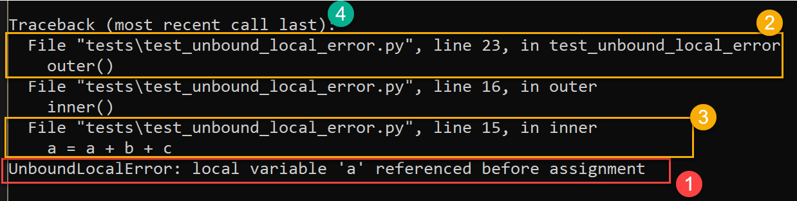

1. Some information about the exception raised which often includes a terse message.

2. The line of code which was executed and eventually led to an exception
   being raised. Most often, this will be code written by the end-user.

3. The actual line of code where the exception was raised.

4. "(most recent last call)" informs us how about the order in which the
   execution occurred.

In some cases, there can be many calls in between 2 and 3; this can contribute
to the confusion experienced by beginners when they are confronted with
similar tracebacks.

Basic anatomy of a friendly traceback
-------------------------------------

Let's have a look at a "friendly traceback" by focusing first on the items
corresponding to those we have highlighted above for a standard traceback.

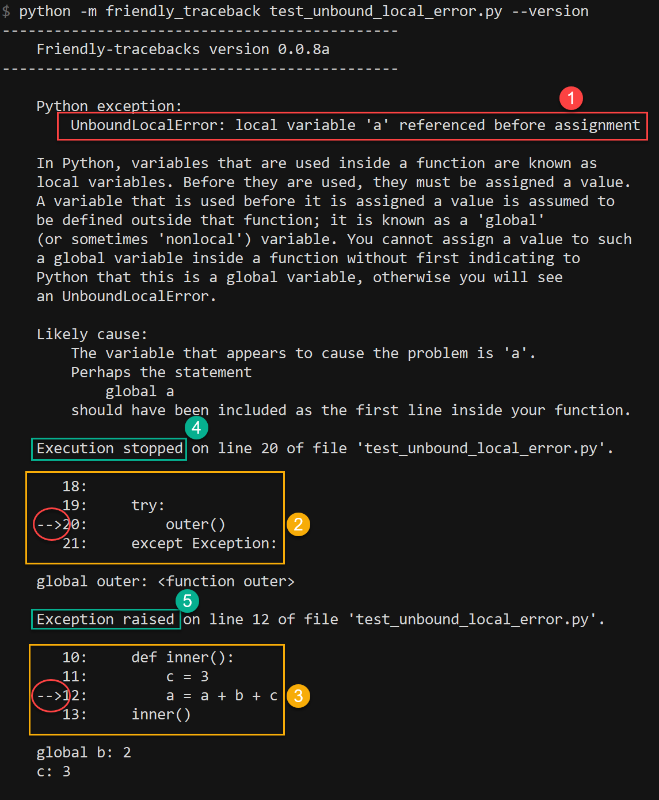

1. The exact same terse information provided by Python about the exception raised.

2. The line of code which was executed and eventually led to an exception
   being raised, shown with a few additional lines to help understand the context.

3. The actual line of code where the exception was raised, shown with a few
   additional lines to help understand the context.

4. and 5. Instead of relying simply on the "(most recent last call)" note
   given by Python, we explicitly state which was the line of code where
   the program stopped, and which one where the exception was raised.
   This is something that can be translated, as shown for the corresponding
   French version (screenshot taken with an earlier version of Friendly-traceback.)

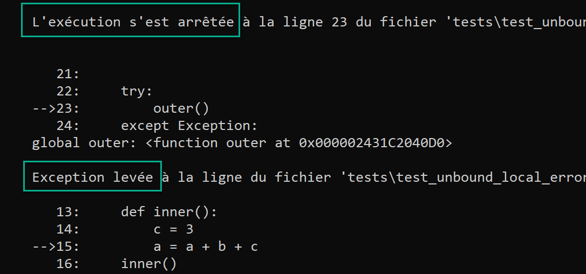

Note that, contrarily to standard Python tracebacks, only the first and last
call made are shown.  In most cases, this should be sufficient to figure out
the cause of the exception, and how to fix it, while avoiding overwhelming
the user with too much information.

Other parts of a friendly traceback
~~~~~~~~~~~~~~~~~~~~~~~~~~~~~~~~~~~~

In addition to what was mentioned above, here's an annotated screen capture
highlighting the other information included in a "friendly traceback", all
of which can be translated.

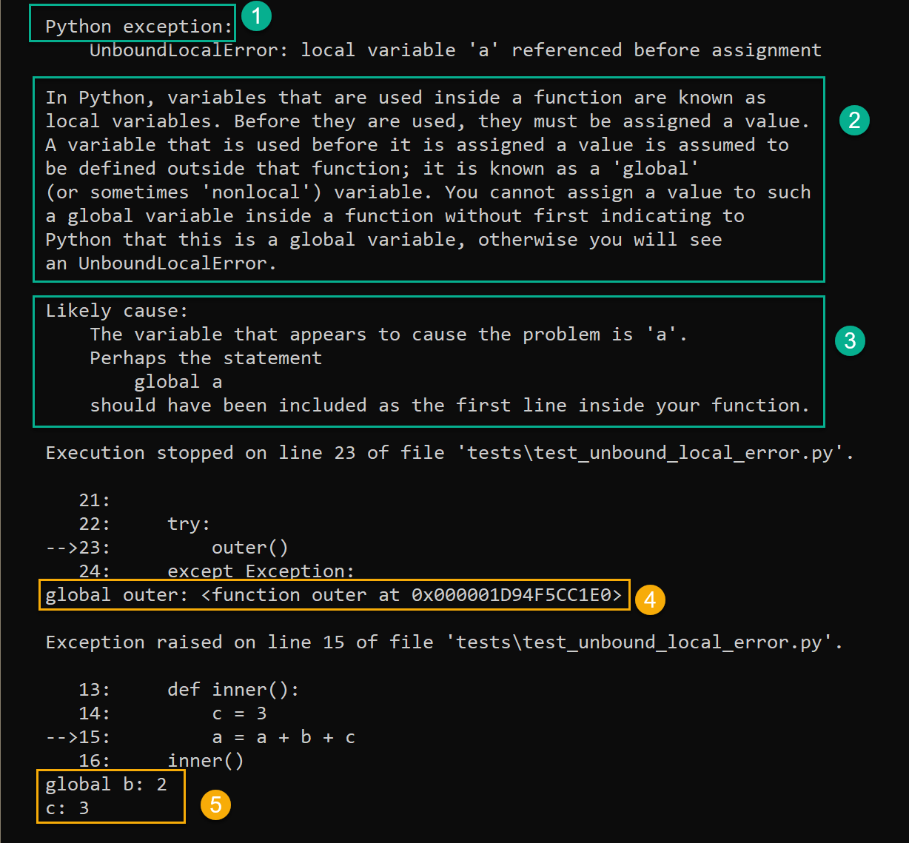

1. A header. This could be customized if a third-party module implemented
   its own custom exceptions.

2. Some generic information about a given exception, simply based on its
   name.

3. Some specific information about this exception. For many exceptions, this
   information is obtained from the message included in a standard Python
   traceback. Sometimes, like in the above, it can include a suggestion as
   to how to fix the problem.
   Other times (see an example below for ``NameError``), it is
   simply rephrasing the information in the Python message which can then
   be translated.

4. and 5. This shows the value of all known variables (local and global) which
   are found on the lines where problems have been noted.

Below is an example where the standard Python message [1] for a ``NameError``
is simply rewritten [2] in English, so that it could be translated.

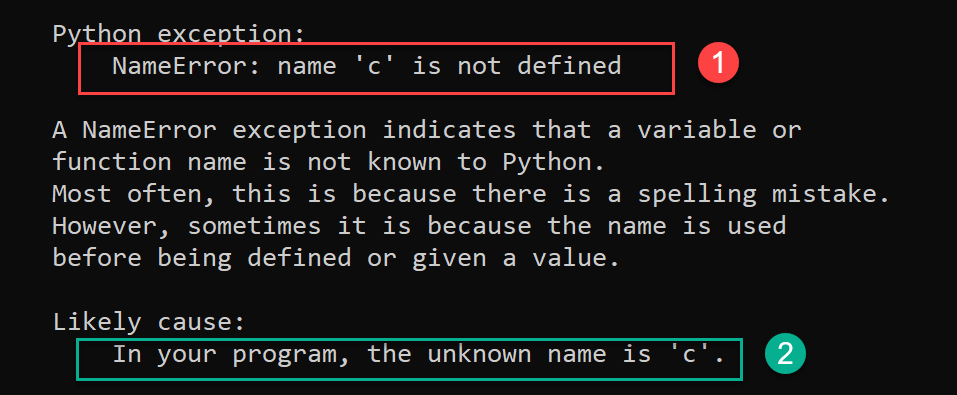

And here is the corresponding French version:

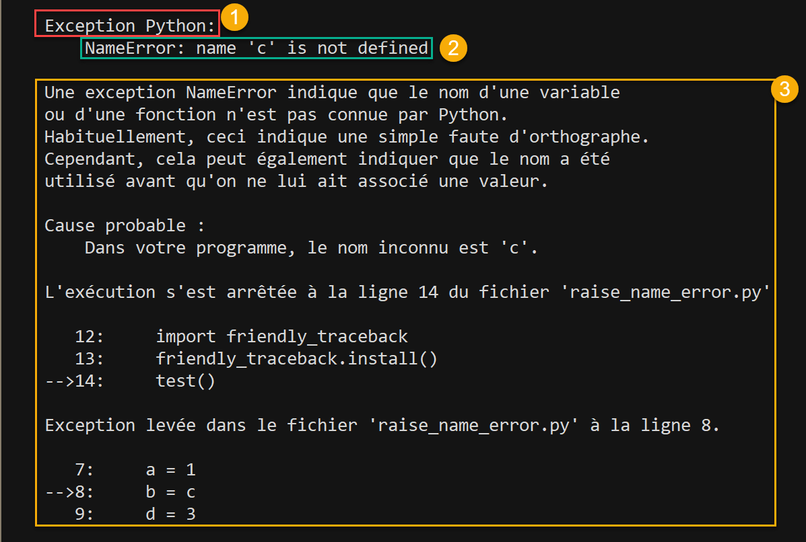

Variable information
~~~~~~~~~~~~~~~~~~~~

As mentioned above, we include the value of all known variables found
on the offending line. In the example below (``IndexError``), this
information [1] together with the reminder [2] and the code from
the offending line [3] give enough information to properly diagnose the error.

.. image:: images/index_error.png
   :scale: 50 %
   :alt: IndexError traceback

In some cases, the value of some variables could, in principle,
yield an enormous amount of text.
To avoid this situation, we truncate any value that exceeds a predetermined
length. However, when we do so, if the variable has a ``__len__`` attribute,
we show its value as it can sometimes be helpful in identifying the problem.

.. image:: images/index_error2.png
   :scale: 50 %
   :alt: IndexError traceback

SyntaxError: invalid syntax
---------------------------

For ``SyntaxError``, Python often offers very little useful information
beyond where it finally identified that a ``SyntaxError`` occurred.
Sometimes, the offending code actually occurred well before: for example,
an open bracket might have been inserted many lines prior to where
the absence of the corresponding closing bracket was noted to cause an error.

For ``SyntaxError``, friendly-traceback does a fairly simple analysis
of the code and tries to identify a single cause which produced the
error.

.. image:: images/syntax_error.png
   :scale: 50 %
   :alt: SyntaxError traceback

How many possible causes?
---------------------------

The idea of showing a single possible cause for a given error is different
than that taken by Thonny_ which, in some cases, attempts to identify more than
one possible cause giving rise to an exception, as well as ordering them
in order of likelihood, based on its own analysis of the code.
Those interested by what Thonny does might want to
`have a look here <https://github.com/thonny/thonny/blob/master/thonny/plugins/stdlib_error_helpers.py>`_.

The idea of showing more than one possible cause for an error
is discussed in Issue8_.

.. _Thonny: https://thonny.org/

As a concrete example, in the image below,
Thonny shows the normal Python traceback [1],
and offers some additional explanations [2], parts of which can be hidden
or revealed by clicking on a button.

.. image:: images/thonny.png
   :scale: 100 %
   :alt: Level 0

Our current thinking is as follows:

1. Friendly-traceback aims to supplement the information provided by Python
   in a normal traceback, in order to make it easier to understand.
   Therefore, it should not second-guess the information given by Python
   when the information is specific enough. For exemple, if we see an
   ``UnboundLocalError``, it could very well be that the cause is really
   a ``NameError`` in disguise. However, trying to figure out if that is the
   case would go beyond explaining and/or translating what a given
   traceback includes as information.

2. For ``SyntaxError``, Python very often includes the rather useless
   ``invalid syntax`` message. Nonetheless, we still try to make an educated
   guess as to what the cause is.  We note however that many programming
   environment (editor or IDE) will include linters that will catch
   syntax errors before a program is run,
   thus helping to prevent ``SyntaxError`` tracebacks from happening.
   While we could, in theory, use third-party linters as
   tools in Friendly-traceback, we believe that such tools more properly
   belong in a programming environment, and that it would be a duplicated
   and largely wasted effort to incorporate such tools in Friendly-traceback.

3. We generally distinguish cases where we can use the information given by Python
   from those where we have to guess by having a different header
   ("Likely cause" vs "My best guess").

4. Trying to provide explanations and translations for all possible
   exceptions will require a considerable amount of work.
   For those, like Thonny, that wishes to
   explore the possibility of suggesting more than one cause, it makes sense
   to add functions in Friendly-tracebacks that could perform this task
   in addition to its current design, so that the community can focus on this
   one package and enhance it as needed. So, Friendly-traceback must be
   designed to easily allow extensions of its core capabilities.

   By default, Friendly-traceback will only print at most one likely cause.
   However, some programming environment
   could use the additional information about possible causes if and when
   it becomes available in Friendly-traceback.

Localization
---------------

As noted above, it is possible to translate almost all the text provided
by friendly-traceback.

When using Python, it is customary to determine which language should
be used to provide translations by a call to 
``locale.getdefaultlocale()``.  In an earlier version, we did this 
but have decided to use English as the default and let the user
(which could be another program that imports friendly-traceback)
decide what language should be used.

The information provided by ``locale.getdefaultlocale()`` includes
not only a language code, but information about a specific region as well.
For example, on my computer, this is ``fr_CA``. As far as I can tell,
gettext does not have a graceful fallback from the specific (``fr_CA``)
to the generic (``fr``); it does have the option of having a fallback
to the version hard-coded in a program.

What we have done is including the possibility
of loading a specific translation with no fallback. If an exception is
raised, we then reduce the length of the language code to the first two
characters, and attempt to load the translation while using
gettext's option of falling back to the hard-coded version if needed.

.. important::

    By default, we should perhaps ask translators to provide generic 2-letter code
    versions for translations, so that a better fallback than the default
    English version could be found.  See the related open question above, as to
    whether or not this should be provided in addition to any region
    specific version.

Verbosity
------------

The useful amount of information to be provided by Friendly-traceback
will be **determined from the feedback from actual users.**
Our current thoughts are that a user should never be shown an overwhelming
amount of information; ideally, when using a REPL, no scrolling should be
required to display all the information.

Currently, the amount of information provided can be controlled via
a "level".  Here are the current levels available, with a sample output.

Level 0
~~~~~~~

This disables friendly-traceback and just shows the normal Python traceback.
It can be set from the commmand line as shown below:

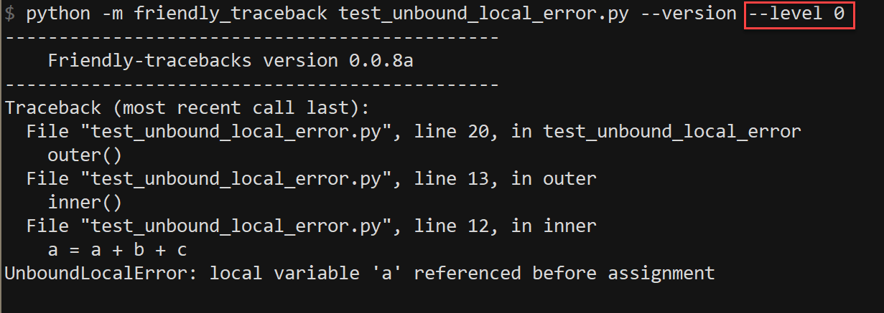

Level 1
~~~~~~~

This is the default, showing all the information mentioned previously.
The screen capture below shows that we set the value explictly to 1; however,
we could have omitted the option ``--level 1`` and the result would
have been the same

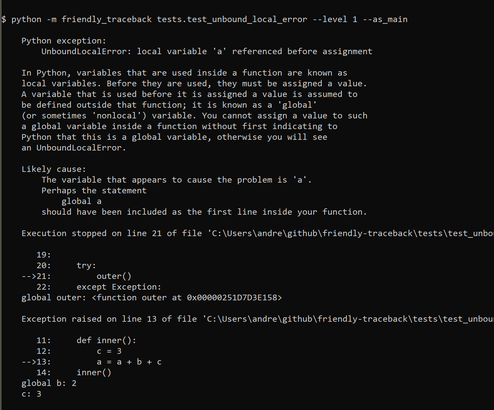

Level 2
~~~~~~~

Same as level 1 but with the "simulated" Python traceback printed **before**
the rest of the information. Note that, in this case, the "simulated"
Python traceback is identical to the normal Python traceback.

.. important:: Which level to use by default?

    Currently, level 1 is the default. Since the secondary aim of
    Friendly-traceback is to help users learn how to use the information
    from normal traceback, perhaps the default should be level 2.

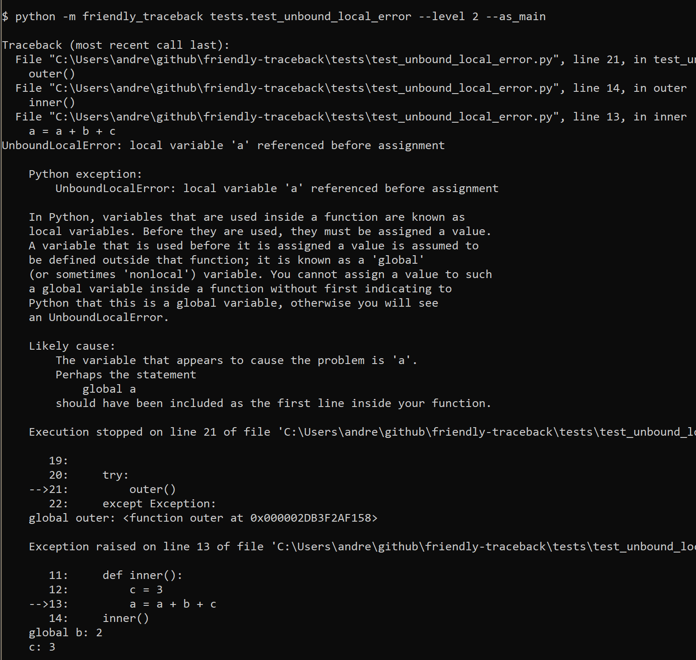

Level 3
~~~~~~~

Same as level 1 but with the simulated Python traceback printed **after**
the complete friendly traceback.

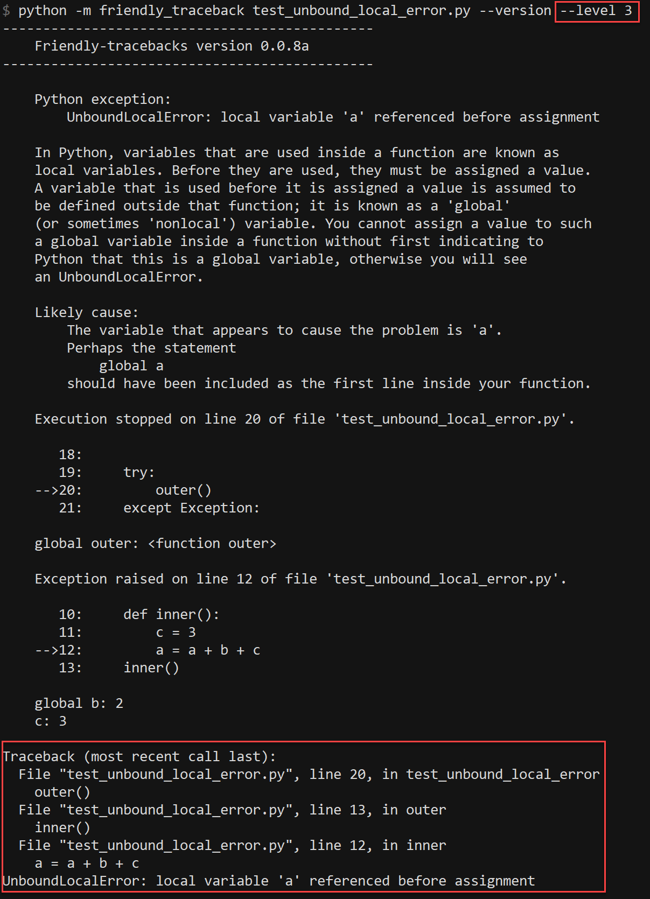

Level 4
~~~~~~~

The simulated Python traceback followed by some generic information about
this type of error and the likely cause that was identified (if any),
but without showing where in the code the error occurred, nor the variables
involved.

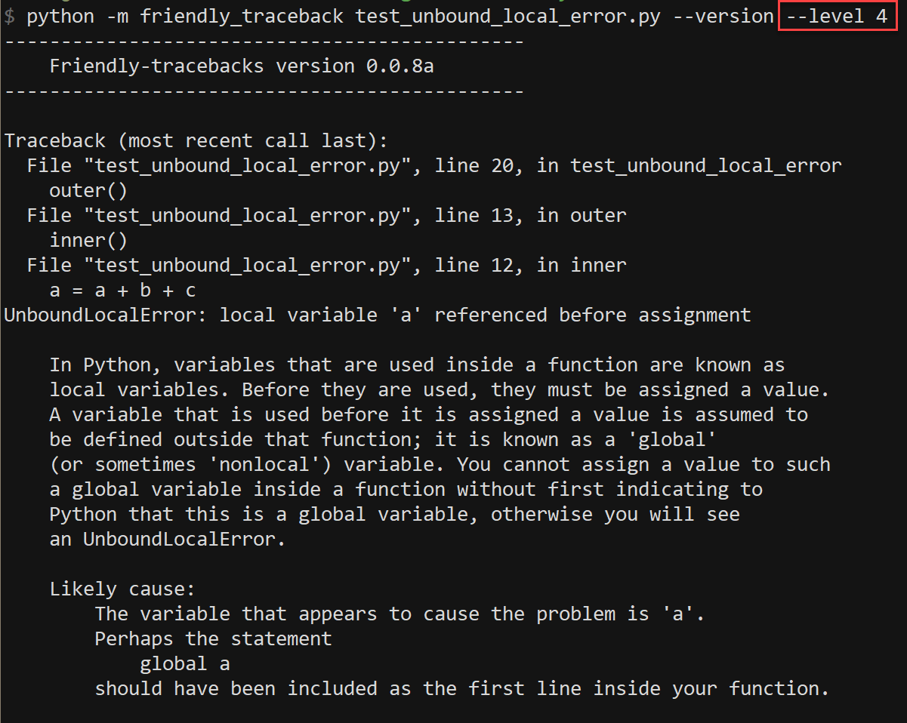

Level 5
~~~~~~~

Like level 4, but without the simulated Python traceback.

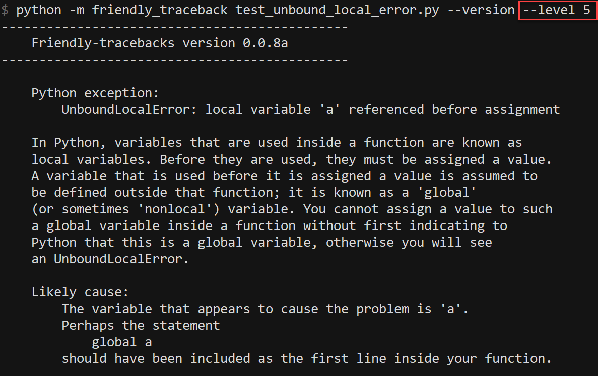

Level 9
~~~~~~~

Only the simulated Python traceback. In this specific case, it is
identical to the normal Python traceback.

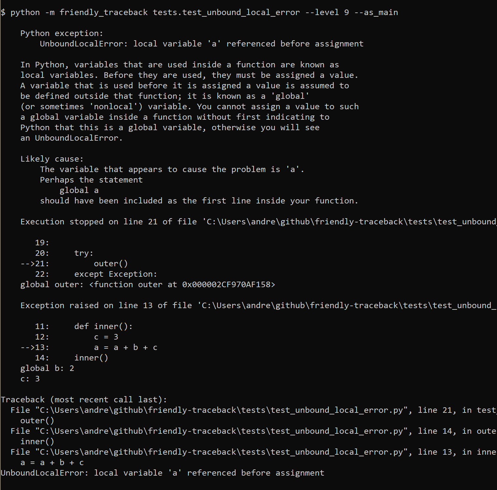

Negative values
---------------

For all the cases above for which the "simulated" Python traceback appears,
asking for a negative level number means to replace the "simulated" Python
traceback by the real Python traceback. As a result of this, level -9 is
identical to level 0.

Setting the verbosity level
~~~~~~~~~~~~~~~~~~~~~~~~~~~~

This can be done when using ``friendly_traceback`` explicitly in the
program with ``friendly_traceback.set_level()``,
or as an option from the command line.

If no such option is provided, then it should be set either from
the local environment variables (as for the language) or from a global
``.ini`` file.

.. sidebar:: Additional open question

    It might be interesting to see if the simulated Python traceback could be
    replaced by something that looks like what
    `better-exceptions <https://github.com/Qix-/better-exceptions>`_ provides,
    but perhaps without added colours, at least initially.

    .. image:: images/better-exceptions.png
       :scale: 50 %
       :alt: traceback from better-exceptions

Extensibility
--------------

For projects that have their custom Exceptions, like
`AvantPy <https://aroberge.github.io/avantpy/docs/html/>`_, it is
be possible to add the custom exceptions to those handled by
friendly-traceback.  See the ``demos`` directory for an example.

It is also possible to use a different formatter.

Other similar projects
------------------------

Many other projects do some enhanced traceback formatting, however
none that we know of aim at

1. making tracebacks easier to understand by beginners
2. translating traceback information.

Still, there is much to learn by looking at what others are doing.
The following is an incomplete list of projects or modules to look at:

- https://docs.python.org/3/library/cgitb.html
- https://github.com/albertz/py_better_exchook/
- https://github.com/Infinidat/infi.traceback
- https://github.com/laurb9/rich-traceback
- http://www.wotevah.com/code/log.py
- https://github.com/ipython/ipython/blob/master/IPython/core/ultratb.py
- https://github.com/patrys/great-justice
- https://github.com/Qix-/better-exceptions
- As mentioned in Issue8_, Thonny_ already has something
  similar implemented.
- https://github.com/cknd/stackprinter

Reference: known exceptions
---------------------------

In the following, those that are followed by an * had been implemented
when this page was last updated.

Those followed by ``!!``, namely ``SystemExit`` and ``KeyboardInterrupt``,
have been excluded as it seemed rather counter-productive to intercept them.

Those followed by ``#``, namely ``GeneratorExit``, ``StopIteration``,
``FloatingPointError``, and
``StopAsyncIteration``, are excluded as they should not normally be
seen by an end user - at least, not by beginners who would need
additional explanation about the meaning of such exceptions.
Furthermore, in the case of ``StopIteration``, see
`PEP 479 <https://www.python.org/dev/peps/pep-0479/>`_.
``FloatingPointError`` is actually
`not used by Python <https://docs.python.org/3.7/library/exceptions.html#FloatingPointError>`_.

``BaseException``, ``Exception``, and ``ArithmeticError`` are base classes which
are not normally seen: some derived classes are normally used instead.
They are denoted by ``**``.

It is very likely that the information below is not up to date.

.. code-block:: none

    BaseException **
     +-- SystemExit !!
     +-- KeyboardInterrupt !!
     +-- GeneratorExit #
     +-- Exception **
          +-- StopIteration #
          +-- StopAsyncIteration #
          +-- ArithmeticError **
          |    +-- FloatingPointError #
          |    +-- OverflowError
          |    +-- ZeroDivisionError *
          +-- AssertionError
          +-- AttributeError
          +-- BufferError
          +-- EOFError
          +-- ImportError *
          |    +-- ModuleNotFoundError *
          +-- LookupError *
          |    +-- IndexError *
          |    +-- KeyError *
          +-- MemoryError
          +-- NameError  *
          |    +-- UnboundLocalError *
          +-- OSError
          |    +-- BlockingIOError
          |    +-- ChildProcessError
          |    +-- ConnectionError
          |    |    +-- BrokenPipeError
          |    |    +-- ConnectionAbortedError
          |    |    +-- ConnectionRefusedError
          |    |    +-- ConnectionResetError
          |    +-- FileExistsError
          |    +-- FileNotFoundError
          |    +-- InterruptedError
          |    +-- IsADirectoryError
          |    +-- NotADirectoryError
          |    +-- PermissionError
          |    +-- ProcessLookupError
          |    +-- TimeoutError
          +-- ReferenceError
          +-- RuntimeError
          |    +-- NotImplementedError
          |    +-- RecursionError
          +-- SyntaxError *
          |    +-- IndentationError *
          |         +-- TabError *
          +-- SystemError
          +-- TypeError *
          +-- ValueError
          |    +-- UnicodeError
          |         +-- UnicodeDecodeError
          |         +-- UnicodeEncodeError
          |         +-- UnicodeTranslateError
          +-- Warning
               +-- DeprecationWarning
               +-- PendingDeprecationWarning
               +-- RuntimeWarning
               +-- SyntaxWarning
               +-- UserWarning
               +-- FutureWarning
               +-- ImportWarning
               +-- UnicodeWarning
               +-- BytesWarning
               +-- ResourceWarning
