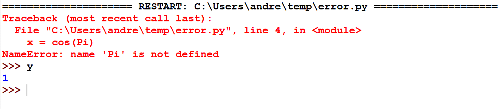
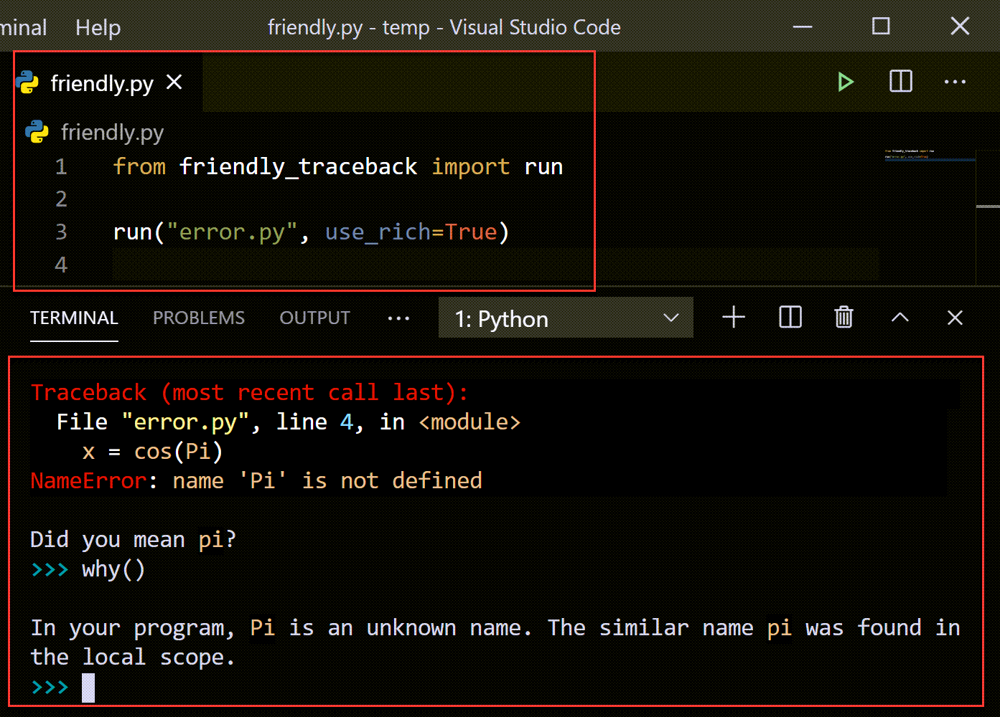

Using with an editor or IDE
============================

Let's have a look at what happens if we run
the following program with IDLE using the 
"Run -> Run Module" menu item.

.. code-block:: python

    from math import *

    y = 1
    x = cos(Pi)

The information about the error is written in red
(sent to ``sys.stderr``), but we can still interact
with the program afterwards, with the variables
defined in the original program being available
in IDLE's console.

Let's do something similar, but using Friendly-traceback
as a program launcher.  The above program was saved
in a file named "error.py". Let's create a second
file with the following content::

    from friendly_traceback import run

    run("error.py")

The following is what happens if we run it, and do
further interactions aftewards.

.. image:: images/idle-friendly.png
   :scale: 50 %
   :alt: Screen capture of IDLE

We stil get a traceback [1] that looks similar to Python's
standard traceback, but that has an added hint [2]
as to what might be the cause of the exception.

Like it was the case with IDLE, we have access [3] to
the variables in our program inside the friendly-console:
did you notice how the prompt is blue instead of black
for IDLE?  This is because we use some ``input()`` statements
to interact in a friendly console, run inside IDLE.

We can ask for more details about the exception [4] and
get some more information [5] about how the possible
cause of the exception was determined.

Using Microsoft VS Code
-----------------------

Let's do the same thing, this time using Microsoft Visual Studio Code,
using an environment in which Rich is installed.
This time, our code launcher is modified as follows::

    from friendly_traceback import run

    run("error.py", use_rich=True)

Some output when the terminal starts it execution, but prior to running
our program, has been removed from the screen capture above.

As you can see, this is much more pleasant to look at then what
we see using IDLE.
