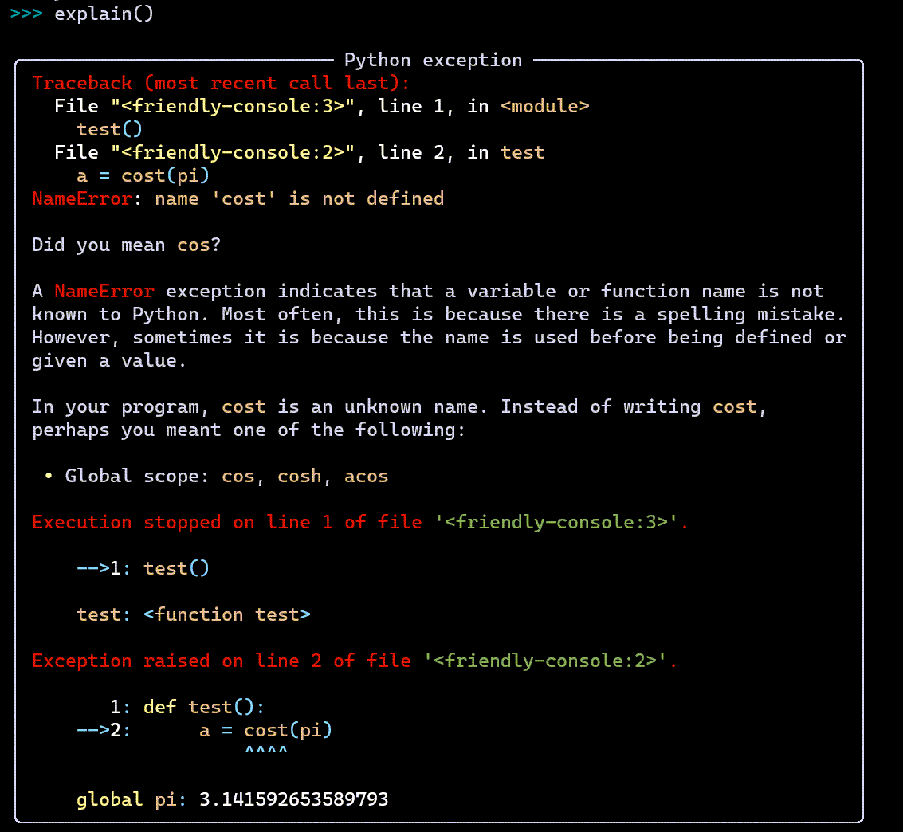

explain()
==========

Sometimes, it might make sense to show all the available information at
once. This is what ``explain()`` does. Let's illustrate it with
a screen capture.

``explain()`` shows everything: a friendly traceback with an
added ``hint()``, as well as the output of
``what()``, ``where()`` and ``why()``.

More about explain()
----------------------

``explain()`` is a bit more versatile than we let it on: it can
take an argument that can change its behaviour.
For example, ``explain("what")`` is equivalent to ``what()``;
``explain("why")`` is equivalent to ``why()``.

