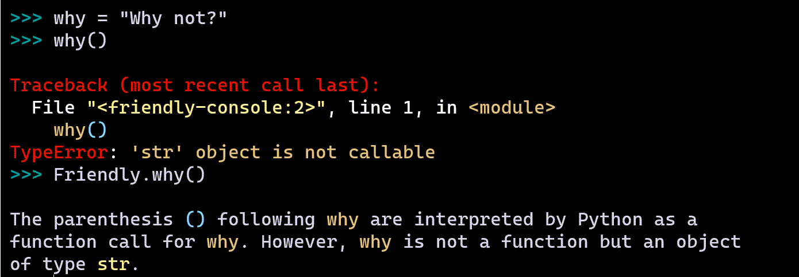

.. _Friendly_object:

Friendly object
================

Everything about the friendly console
=======================================

What happens if someone uses an object with the same name
as a friendly helper function?

As you can see, these functions are also available as static
methods of a ``Friendly`` object.

.. todo::

   Add more documentation about this including about
   ``repr(Friendly)`` and ``dir(Friendly)``.
