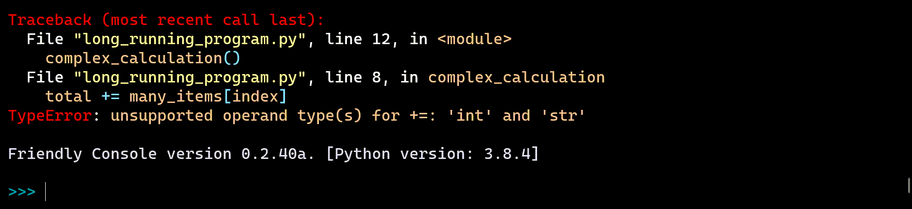

history() and back()
=====================

Earlier, I mentioned that I recommend that beginners use an editor
instead of a REPL for writing Python code.
The main reason is that it is easier to correct
mistakes, and does not require to rewrite entire lines of code.
At the same time, I recommend the use of friendly's console to "ask questions"
when an exception is raised.

Consider the following situation, with some code that takes
a long time to execute:

Suppose I want to have more details about where the exception
was raised.

I made a mistake; no problem, friendly told me how to fix it.

Unfortunately, this is not the exception I was looking for.

Instead of having to run the entire program once again, friendly
has preserved a history of the exceptions seen so far, and allows me
to discard them one by one, starting with the last one.

.. image:: images/history4.png
   :scale: 40 %

The only exception left is the one of interest.

I found the cause of the error: I wrote a string ``'13'`` instead of an
integer.
