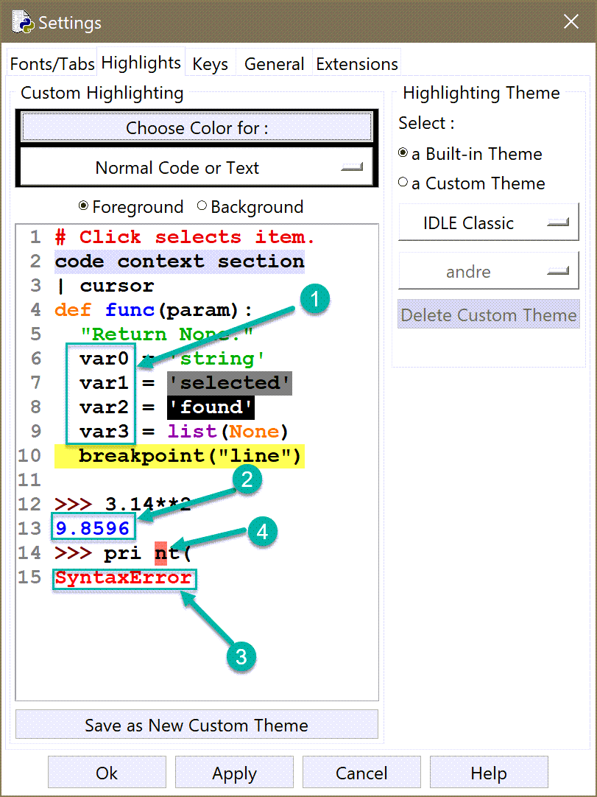

About IDLE
=====================

IDLE is often the first program that is used by beginners
learning Python since it is installed with Python.
It includes its own REPL (known as its "shell") and enable
users to write code in editors and run them, with the output
redirected to the shell.

Before Python version 3.10.0a5, IDLE did not allow a user to
define their own "exception hook" to modify the information shown to
a user. Since then, it is possible to have IDLE use a custom
exception hook **except** when dealing with syntax errors.
To get the most out of friendly, **I recommend to use
friendly's own console instead of IDLE's shell** as described
on the next page.

Colours
-------

In most other programs where colour output is possible,
friendly uses pygments, either directly or indirectly
to add colour. This is not possible when using IDLE.

Idle provides a few pre-defined element types to which colouring
can be applied.

In the default scheme:

1. The default colour is black.
2. Anything "printed" normally (``print() --> sys.stdout``) is in blue.
3. Anything printed following an exception (sent to ``sys.stderr``) is in red.
4. IDLE uses a red background to highlight a specific position of a syntax error
   as identified by Python.

Friendly makes use of the colours chosen for these four basic
elements when it formats the information presented to the user.
The specific colour used for each of these cases can be changed by
according to your preferences.
