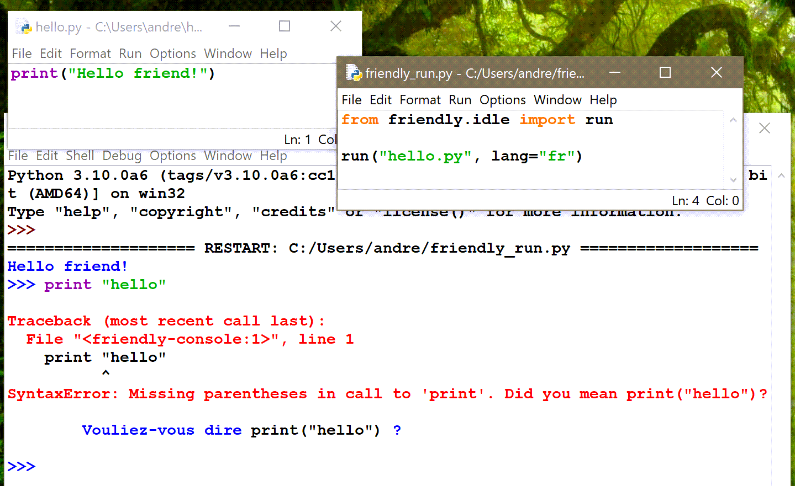

IDLE: using the editor
========================

Since IDLE is part of the standard library, it is often the first
editor that is used by beginners learning Python.
Let's have a look at what happens if we run
a program with IDLE using the
"Run -> Run Module" menu item.

.. image:: images/python_idle.png
   :scale: 50 %
   :alt: Screen capture of IDLE

Below, I did something similar, but using Friendly
as a program launcher, and using French as the default
language. After the program's execution had been
completed, I entered more code, making a syntax error.

