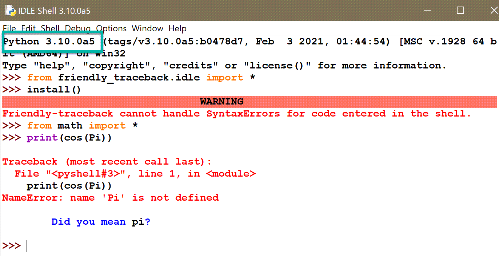

IDLE's shell
============

.. admonition:: Summary

    Friendly-traceback has a special mode for IDLE.
    It is strongly recommended to use the Friendly console by
    using the following two instructions when beginning a session::

        from friendly_traceback.idle import *
        start_console()

Since it is almost always included with Python,
IDLE is very often the first editor/IDE that Python beginners use.
It comes with its own repl (also known as its "shell") which does
syntax coloring. By default, it uses blue for anything printed normally
(to stdout) and red for anything printed as part of an exception (to stderr).
When a SyntaxError is recognized, the location of that error is
highlighted, with red background.

.. image:: images/idle.png
   :scale: 60 %
   :alt: Screen capture of IDLE's shell

You can use the Friendly console within IDLE's shell by first using
a special import statement::

    from friendly_traceback.idle import *

To start the Friendly console, you need to then use ``start_console()``.

.. image:: images/idle-friendly.png
   :scale: 60 %
   :alt: Screen capture of the Friendly console within IDLE

As you can see, the prompt is in blue as it is "printed" using
the ``input()`` function.  

Friendly's output within IDLE uses
three different colours: black for code, red for anything related
to a traceback, and blue for everything else. It also adopts
IDLE's feature of highlighting the location of an error using
a red background; however, unlike IDLE's itself, it does not do
so in the code entered previously, but only in its own output.

Starting with Python version 3.10.0a5, IDLE's shell allow the
use of customs ``sys.excepthook()`` to process runtime
errors (but not syntax errors). So, instead of starting
a Friendly console using ``start_console()``, Friendly traceback can
be "installed" within IDLE's shell and provide information
for runtime errors. After using the same special
import statement as before,

.. code-block::python

    from friendly_traceback.idle import *

I used ``install()`` to replace IDLE's handling of runtime errors
by Friendly-traceback's version.

Unfortunately, since syntax errors cannot (yet) be processed by Friendly-traceback
in this mode, I do not recommend to use it in this way.

IDLE's developers are aware of this current limitation and might
provide in a future version a way for Friendly-traceback to "hook" into IDLE's
mechanism for dealing with syntax errors.
