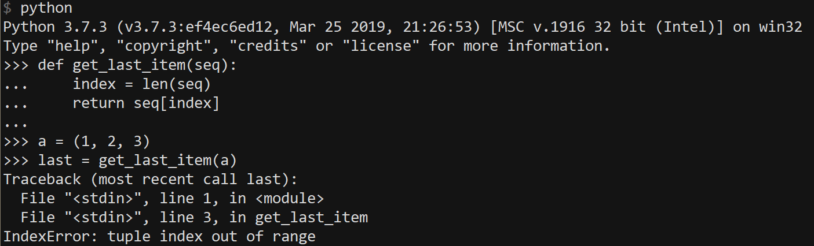
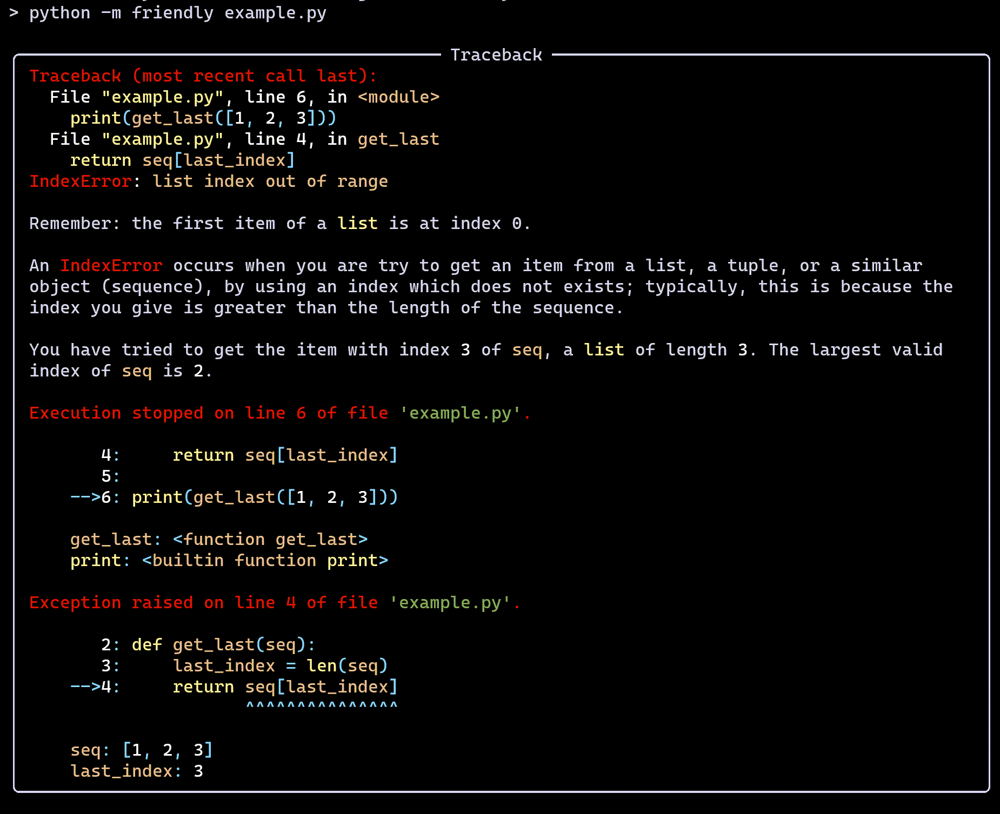
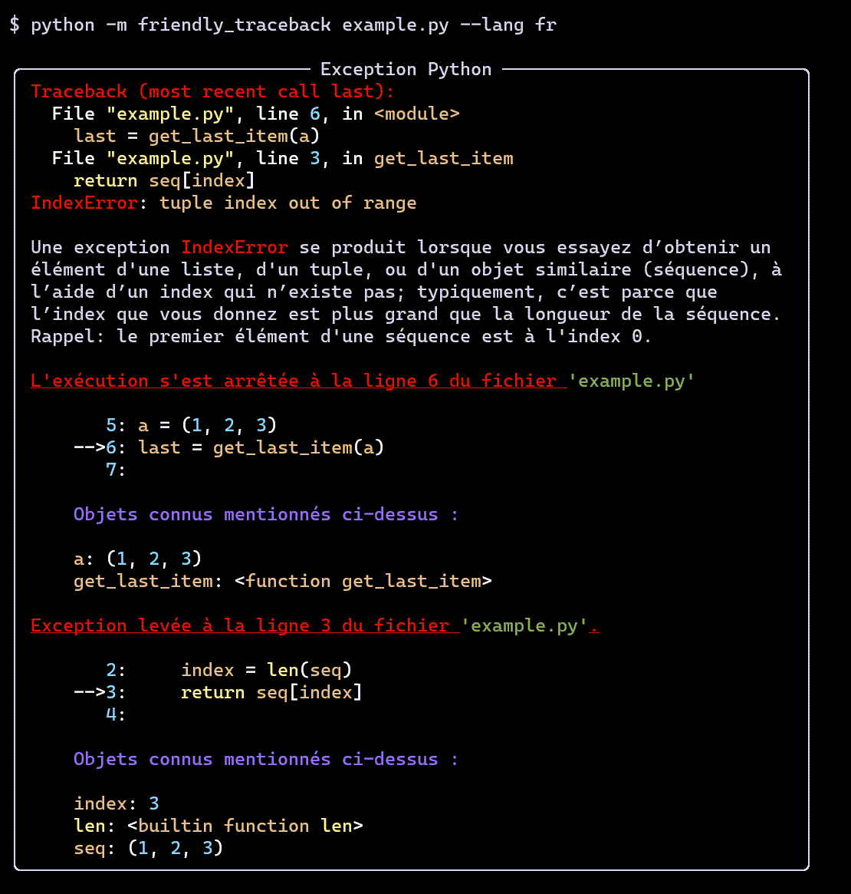

Bienvenue 환영합니다 Bienvenido - ようこそ Welcome  歡迎光臨
========================================================================

**Friendly tracebacks** - Simplified Python tracebacks translatable into
any language.

`Code on Github <https://github.com/aroberge/Friendly-traceback>`_

In a nutshell
--------------

There exists many Python projects, including some listed below,
whose primary goal is to supplement the information
given by Python traceback to make them more useful for **advanced** programmers.
Friendly-traceback is **not** one of these projects.

While Friendly-traceback can be useful for advanced programmers,
it is aimed aimed primarily at beginners and/or at users
who would like to get information about traceback in their own language.
Friendly-traceback can give more detailed information as to
**where** an exception occurred, **what** a given exception means and
**why** it might have occurred (including, sometimes, how to fix it).

While Friendly-traceback can be used on its own with a specially
designed console, a better option would be to use it together with
GUI-based editors/IDE. We explain how to do so later.
For now, we just show one quick example.

A quick look
------------

First, we show what happens when we use Python
to run a program that raises an exception.

Not exactly the most helpful information for beginners ...

Here's the corresponding version from Friendly-traceback,
making use of
`Rich <https://github.com/willmcgugan/rich>`_ which has been
installed separately.

One unique feature of Friendly-traceback is that all the information
it provides can be translated into another language; currently, only
English (by default) and French are available.

**Keep reading if you want to find out more.**

.. toctree::
   :maxdepth: 1
   :hidden:
   :caption: Begin here

   usage
   Console basics <repl>
   editor
   mu
   thonny
   tracebacks

.. toctree::
   :maxdepth: 1
   :hidden:
   :caption: Thoughts on design

   design
   themes

.. toctree::
   :maxdepth: 1
   :hidden:
   :caption: Use in your project

   api
   lies
   formatter
   usage_adv
   plugins

.. toctree::
   :maxdepth: 1
   :hidden:
   :caption: Contribute

   suggest
   adding_exception
   syntax_error
   translation_notes

.. toctree::
   :maxdepth: 1
   :hidden:
   :caption: All the tracebacks!

   all_tb
   known
   Friendly tracebacks - Python 3.6 in English <tracebacks_en_3.6>
   SyntaxError - Python 3.6 in English <syntax_tracebacks_en_3.6>
   Friendly tracebacks - Python 3.7 in English <tracebacks_en_3.7>
   SyntaxError - Python 3.7 in English <syntax_tracebacks_en_3.7>
   Friendly tracebacks - Python 3.8 in English <tracebacks_en_3.8>
   SyntaxError - Python 3.8 in English <syntax_tracebacks_en_3.8>
   Friendly tracebacks - Python 3.9 in English <tracebacks_en_3.9>
   SyntaxError - Python 3.9 in English <syntax_tracebacks_en_3.9>
   Friendly tracebacks - Python 3.10 in English <tracebacks_en_3.10>
   SyntaxError - Python 3.10 in English <syntax_tracebacks_en_3.10>
   compare_exceptions
   compare

.. toctree::
   :maxdepth: 1
   :hidden:
   :caption: Markdown examples

   tracebacks_markdown
   tracebacks_syntax_markdown

.. toctree::
   :maxdepth: 1
   :hidden:
   :caption: En français

   tracebacks_fr
   syntax_tracebacks_fr

Todo
----

.. todolist::
