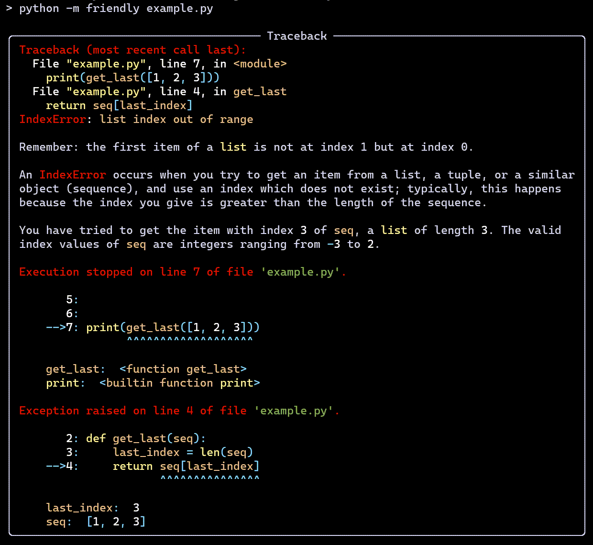

Bienvenue 환영합니다 Bienvenido - ようこそ Welcome  歡迎光臨
========================================================================

**Friendly tracebacks** - Simplified Python tracebacks translatable into
any language.

`Code on Github <https://github.com/aroberge/friendly-traceback>`_

.. warning::

    This is pre-alpha software, currently in development.
    The API is subject to change without notice; such changes may not
    be included (yet) in this documentation.

In a nutshell
--------------

There exists many Python projects intended to supplement the information
given by Python traceback to make them more useful for **advanced** programmers.
Friendly-traceback is **not** one of these projects.

Friendly-traceback is aimed primarily at **beginners** and/or at users
who would like to get information about traceback in their own language.
Please, see the Design section for a complete description of the goals
of this project. But for now, let's have a quick look at a standard
Python traceback when using the REPL.

.. image:: images/python_indexerror.png
   :scale: 50 %
   :alt: Python IndexError

Not exactly the most helpful information for beginners ...

Here's the corresponding version from Friendly-traceback's REPL

The only thing that is shown in exactly the same way is the line showing
the exception name and a message.  Everything else can be made available
in other languages.

.. image:: images/friendly_indexerror_fr.png
   :scale: 50 %
   :alt: Friendly IndexError in French

About the version
-----------------

Typically, the version shown at the top will have the letter "a" at the end.
This means that the latest update to the documentation was made after
a release with a version number without the "a" was uploaded to Pypi,
and that we are working towards the next release.
As a result, some features shown here may be slightly different
from the version available from Pypi.

Contents
--------

.. toctree::
   :maxdepth: 1

    Usage <usage>
    Occasional lies <lies>
    Design <design>
    Friendly tracebacks - Python 3.8 in English <tracebacks_en_3.8>
    SyntaxError - Python 3.8 in English <syntax_tracebacks_en_3.8>     
    Suggest an addition <suggest>
    Developer: Adding a new Exception <adding_exception>
    Developer: Adding a new SyntaxError <syntax_error>
    Project files <graph>
    Public API <api>
    Demos: how to use in your own project <custom>
    Notes on translations - using gettext <translation_notes>    
    Comparison between Python versions <compare>   
    Friendly tracebacks - Python 3.6 in English <tracebacks_en_3.6>
    SyntaxError - Python 3.6 in English <syntax_tracebacks_en_3.6>
    Friendly tracebacks - Python 3.7 in English <tracebacks_en_3.7>
    SyntaxError - Python 3.7 in English <syntax_tracebacks_en_3.7>
    Friendly tracebacks - Python 3.7 en Français <tracebacks_fr>
    SyntaxError - Python 3.7 en Français <syntax_tracebacks_fr>
    Change Log <changelog>

.. todolist::
