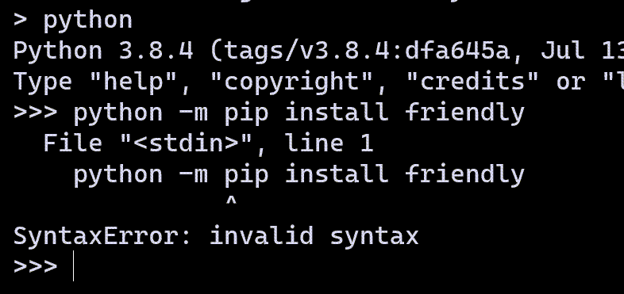
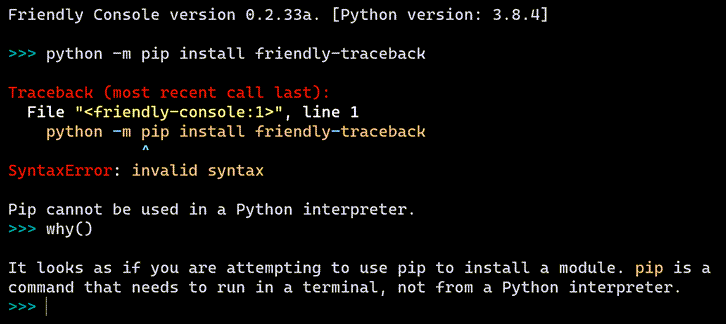

Installation 
==============

.. hint::

    |mu_logo| If you use Mu, you should ignore this page as some
    Mu-specific instructions are provided later.

Installation
-------------

You can install friendly from `PyPI <https://pypi.org/>`_ in the usual way::

    python -m pip install friendly

This needs to be done from a terminal.
In the command shown above,
``python`` refers to whatever you need to type to invoke your
favourite Python interpreter.
It could be ``python``, ``python3``, ``py -3.8``, etc.

Instead of ``python -m pip install ...``, some tutorials might suggest
to simply write ``pip install ...``; I do not recommend this as it might
not install programs in the right "environment" for your computer.

Mistake to avoid
-----------------

A mistake often made by beginners is
to try to use ``pip`` from within Python.

The error message is not very helpful.
This is what it might look if you had already been using friendly.

