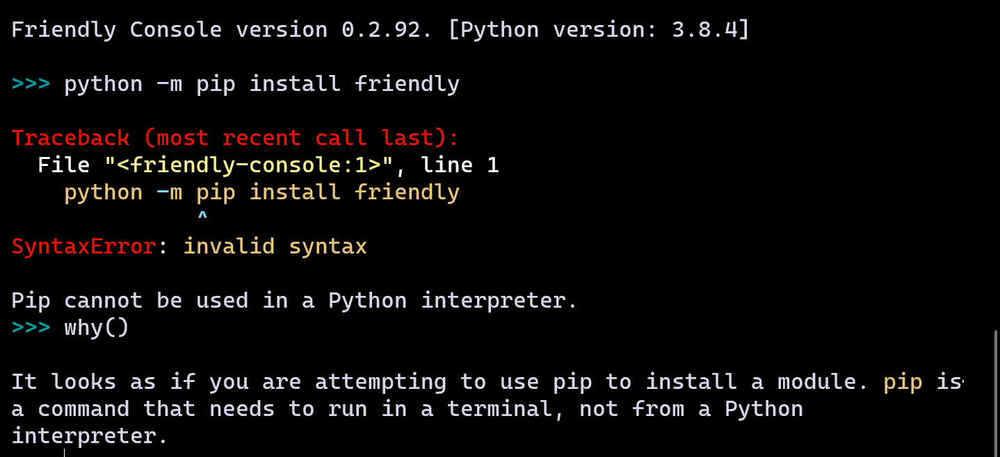

Installation 
==============

.. hint::

    |mu_logo| Skip this page if you use Mu.

.. |mu_logo| image:: images/mu_logo.png

Installation
-------------

You can install Friendly from `PyPI <https://pypi.org/>`_ in the usual way::

    python -m pip install friendly

Of course, if this is the first time you install a package from PyPI,
you might get some weird error. This is what it might look if you
had already been using Friendly.

In the command shown above,
``python`` refers to whatever you need to type to invoke your
favourite Python interpreter.
It could be ``python``, ``python3``, ``py -3.8``, etc.
