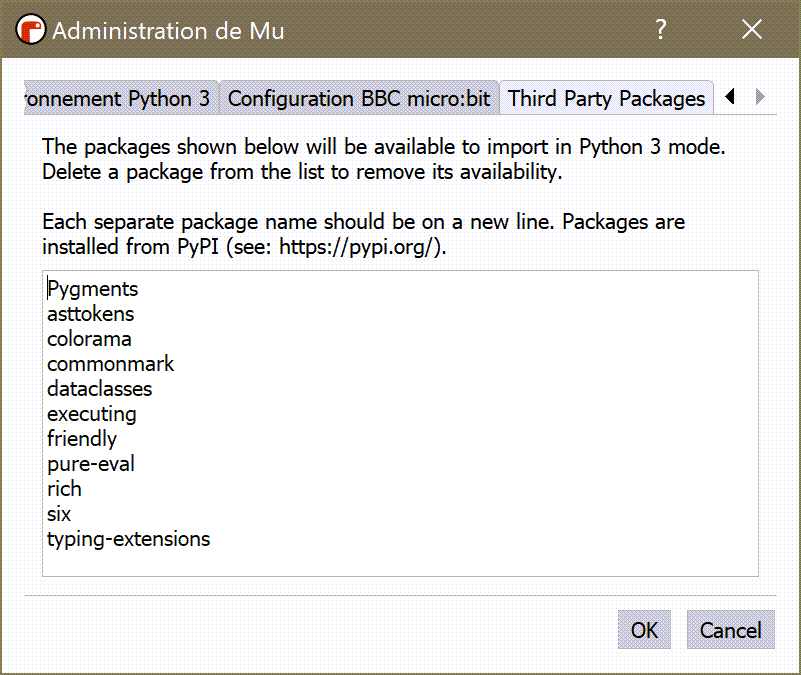

.. tip::  Skip this page if you are not using Mu.

Using with Mu: installation
===========================

`Mu <https://codewith.mu/>`_ is a fantastic editor for absolute beginners.
Its design philosophy is to enable beginners to download a single
program that comes with everything they need to begin their programming
journey.

It is possible that, in the future, Friendly-traceback might
be incorporated inside Mu, available at the click of a button.
For now, it needs to be installed separately.
Note that the ability of installing third-party packages in the
environment used by Mu is only available in the latest development version.

.. warning::

    In addition to standard Python, Mu has different "modes" which allow
    the use of other Python versions such as MicroPython and CircuitPython.
    I do not know if Friendly-traceback can work with these other
    modes, and cannot provide support for them.

Installation
------------

I assume that you have installed Mu on your computer.
Mu picks up the language to use from the computer default settings,
which explains why French appears on the screen capture below.
However, that language settings not used Friendly-traceback;
there are other ways to make Friendly-traceback aware of your favourite
language. [For now, only French and English are available.]

After you start Mu, you should see a gear icon at the bottom right
corner.

.. image:: images/mu.png
   :scale: 50 %
   :alt: Mu

If you click on it, it will bring the following dialog.

.. image:: images/mu_dialog1.png
   :alt: Mu dialog

Click on the triangular "arrow" until the *Third Party Packages* tab is shown.

.. image:: images/mu_dialog2.png
   :alt: Mu dialog

Enter "Friendly-traceback" and click "ok".  Friendly-traceback should
be installed. The version installed should be 0.2.39 or newer.

.. image:: images/mu_dialog3.png
   :alt: Mu dialog

Friendly-traceback uses other packages that are installed at the same
time. If you look at the *Third Party Packages* tab again, you
should see something like this:

Note that the exact packages listed might be different than what you see here.
