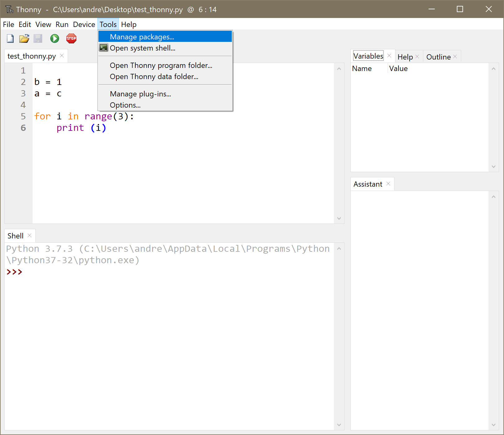
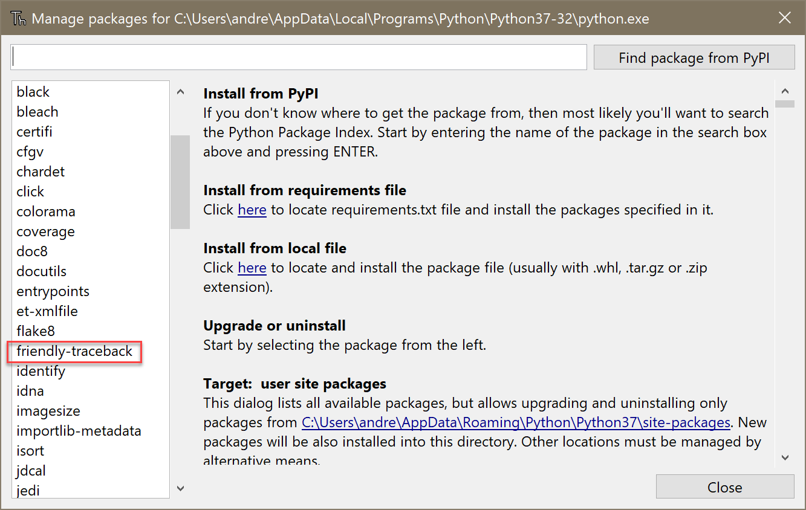

.. _using_thonny:

.. tip::  Skip this page if you are not using Thonny.

.. sidebar:: A bit of history

    Starting with version 3.2.5, the creator of Thonny kindly
    included built-in support for
    an early version of Friendly. As Friendly evolved,
    I suggested that the built-in support be temporarily removed so as to avoid
    any incompatibility; this has happened in newer versions of Thonny.

    In the near future, I hope to add a way to add back some built-in
    support for Friendly in Thonny, to complement its built-in
    "Assistant".

Information for Thonny
===============================

`Thonny <https://github.com/thonny/thonny/>`_ is a fantastic
programming environment for learning Python.

Thonny is highly configurable. Among the tools
it provides is the ability to install packages either from pypi or
others found locally.

If you have already installed Friendly,
the first step is to ensure that Thonny can see that Friendly
is installed. If not, it means that Thonny uses a different environment
than the one in which you installed Friendly;
in this case, you can use Thonny's package manager to
install Friendly.

As you can see, Friendly is indeed installed on my
computer, along with many other packages.

