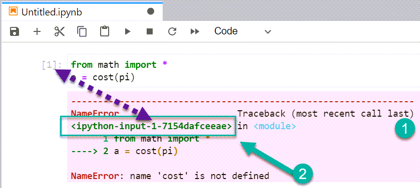

IPython and Jupyter notebooks
==============================

friendly supports IPython console and Jupyter notebooks and variants.
Currently, this has been done more as a proof of concept than anything
else: we are not aware of anyone else having made use of this feature.
We also almost never test it; please feel free to report any issues.

JupyterLab notebook
--------------------

By default, tracebacks in JupyterLab notebooks (or Juypter notebooks)
displayed in a browser are given a pink background (1).

The "location" of the error (2) includes is of the form
``<ipython-input-A-B>`` where ``A`` is the code block number
and ``B`` is an internal value ("hash_digest") of no particular use
to a end user. This hash_digest is removed by friendly
as shown below.

.. image:: images/jupyter-lab-default.png
   :scale: 60 %

1. Tracebacks shown by friendly do not have a pink background.

2. The *formatter* value is changed from the default to ``'repl'``.

3. This ``'repl'`` choice results in a plain output on pink background.

4. A different syntax colouring (``'rich'`` formatter with ``'light'`` style)
   is also available. Note that, by default, the default style is ``'dark'``.

5. The default formatter is known as ``'jupyter'``.

Dark background
----------------

JupyterLab also gives the choice of a dark background theme.

.. image:: images/jupyter-lab-dark.png
   :scale: 60 %

However, in this case, the ``'rich'`` formatter might perhaps yield better
looking tracebacks.

.. image:: images/jupyter-lab-dark-rich.png
   :scale: 60 %

About the hash_digest
~~~~~~~~~~~~~~~~~~~~~~

The hash_digest is meant to uniquely identify the content of a code block.
However, this does not appear the case when the same code is entered
in different cells for sessions where one uses more than one notebook.
`I suggested what I believe is a better approach <https://github.com/ipython/ipython/issues/12755>`_ using
the kernel number instead of the hash_digest: the combination of
the code-block number and kernel number should be unique.
However, IPython developers are certainly swamped with issues to consider
and would be right not to consider this a high priority item to look at,
although it might prevent some messages one occasionally gets about
the need to restart a kernel.
