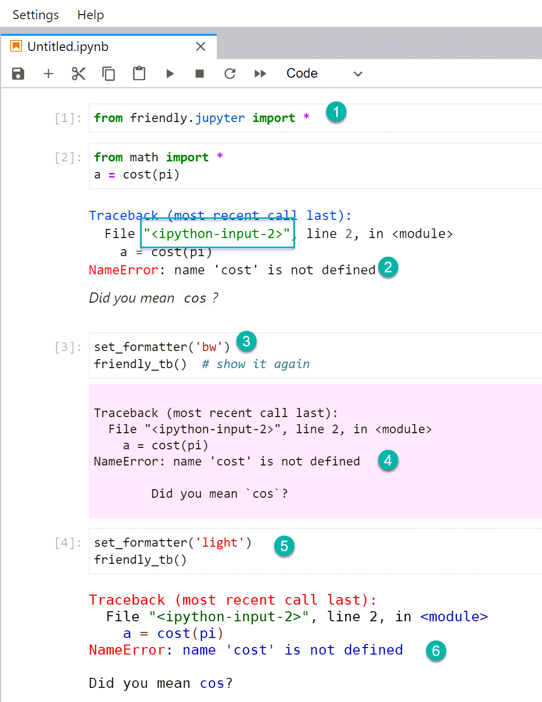

IPython and Jupyter notebooks
==============================

Friendly-traceback supports IPython console and Jupyter notebooks and variants.
Currently, this has been done more as a proof of concept than anything
else: we are not aware of anyone else having made use of this feature.
We also almost never test it; please feel free to report any issues.

Installation and usage
----------------------

To use Friendly-traceback in such environments, you need to do one or
two things:

1. Import a special module that does the automatic installation and makes
   console commands available.

2. Optionally, set a different formatter.

Through various screenshots below, we document how to use Friendly-traceback
with IPython, and show what you might expect.

The available commands are the same as those using a friendly-console;
see :ref:`using_repl` for details.  Since this documentation could be
out of date, it is suggested that you use Python's ``dir()`` to see
what commands area available.

Basic example (not IPython)
-----------------------------

In what follows, we will always use the same example to generate an
exception::

    from math import *
    a = cost(pi)

After the exception is raised, we will get more information using
``explain()``, so that we can show how well, or how poorly in a few cases,
the information is displayed.

For comparison, we start with the traceback shown using our
friendly-console on Windows.

.. image:: images/friendly-ipython-section.png
   :scale: 40 %

Using the IPython console in a terminal
----------------------------------------

In this section, we document our use of the IPython console in a
Windows Terminal; we use the old-style `cmd` rather than the Windows
PowerShell.

.. image:: images/ipython-console-repl.png
   :scale: 40 %

By default, the 'repl' formatter is used: this is something that just
copies the information provided by Friendly-traceback with no added
formatting.

We can change this to use the 'rich' formatter, which is the same
as for the non-IPython example above. However, the colours are
completely different.

.. image:: images/ipython-console-rich1.png
   :scale: 40 %

Furthermore, occasionally some file names are highlighted in such
a way as to make them almost unreadable.

.. image:: images/ipython-console-rich2.png
   :scale: 40 %

However, most IPython users will likely work in a different environment
than a traditional console.

JupyterLab notebook
--------------------

By default, tracebacks in JupyterLab notebooks (or Juypter notebooks)
displayed in a browser are given a pink background.
This remains the case if we use install Friendly-traceback without
specifying a special formatter.

Using the 'jupyter' formatter definitely improves the appearance.

.. image:: images/jupyter-lab-jupyter.png
   :scale: 50 %

This formatter uses some HTML display feature of IPython.
If we change the settings of JupyterLab to a dark theme, the
display remains quite readable.

.. image:: images/jupyter-lab-dark.png
   :scale: 50 %

However, in this case, the 'rich' formatter might perhaps yield better
looking tracebacks.

.. image:: images/jupyter-lab-dark-rich.png
   :scale: 40 %

In a JupyterLab environment, we can also use a console within a
browser intead of a notebook. Here's what it looks like with the
'rich' formatter.

.. image:: images/jupyter-lab-dark-console-rich.png
   :scale: 40 %
