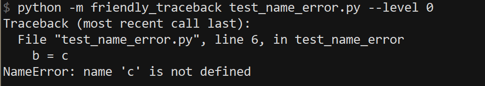
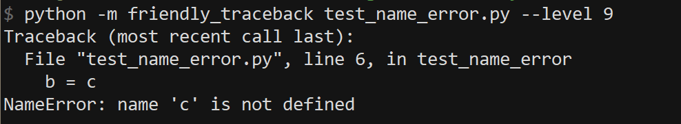
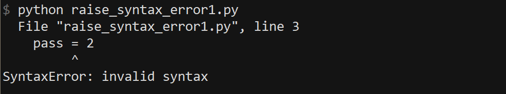
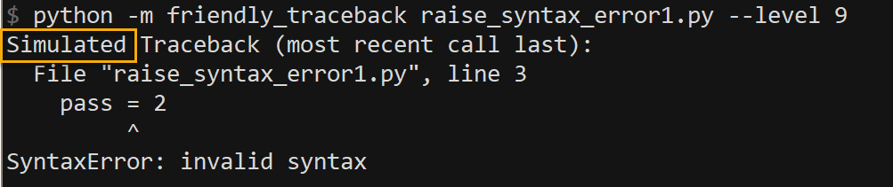
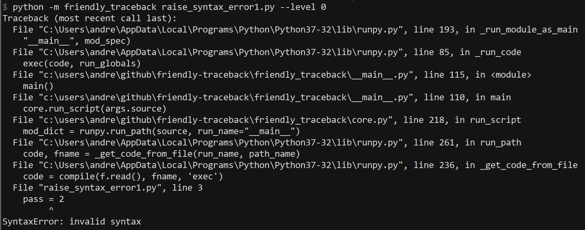

Intentional lies
================

Let me let you in on a secret:
occasionally, Friendly-traceback will lie to you.
When it does so, it will indicate it to you;
however, it will do so in a way that might be easily overlooked.

Have a look at the following screen captures, all taken using
version 0.0.8a  (Python version: 3.7.3 on Win 32). (Most other screenshots
normally include Friendly-traceback version.)

First, we show a traceback generated with ``level`` set to 0:
with this choice, the output only includes the normal
Python traceback.

Next, we show a traceback generated with ``level`` set to 9:
this corresponds to the "simulated" Python traceback as
determined by Friendly-traceback.  The traceback is
identical to the true Python traceback as above.

So far, Friendly-traceback has not lied. Let's look at another
example, first run directly with Python.

Because the traceback contains only a single step, Python did not
include the standard header ``Traceback (most recent call last):``.

Here's the "simulated" Python traceback generated by Friendly-traceback.

Notice how the standard header appears, but preceeded by the word
"Simulated".

Here's the **true** Python traceback generated (displayed with ``level`` 0)
while this same script is run by Friendly-traceback:

This traceback contains a lot more information, as Friendly-traceback
uses Python's ``runpy`` module as well as its own functions to run this
script - all of which are shown in this traceback.
To avoid confusing users, when it is desired to include a Python traceback
in the information provided by Friendly-traceback, the default will
be to include a "simulated" traceback, where all traces of
Friendly-traceback's own functions, as well as Python's ``runpy`` module,
will be removed.  When such calls are removed, the traceback header
will have the word "Simulated" inserted first.  If no calls are removed,
like in the very first example, then the word "Simulated" does not appear.

You can lie too
---------------

Sometimes, you might wish to exclude other modules from the
simulated Python traceback. For example, in Friendly-traceback's console,
the Python ``codeop.py`` module might sometimes appear due to the
way we process the users' code. To instruct Friendly-traceback
from including this module in the "simulated" traceback,
we need to have the following two lines of code::

    import codeop
    friendly_traceback.utils.add_excluded_path(codeop.__file__)

