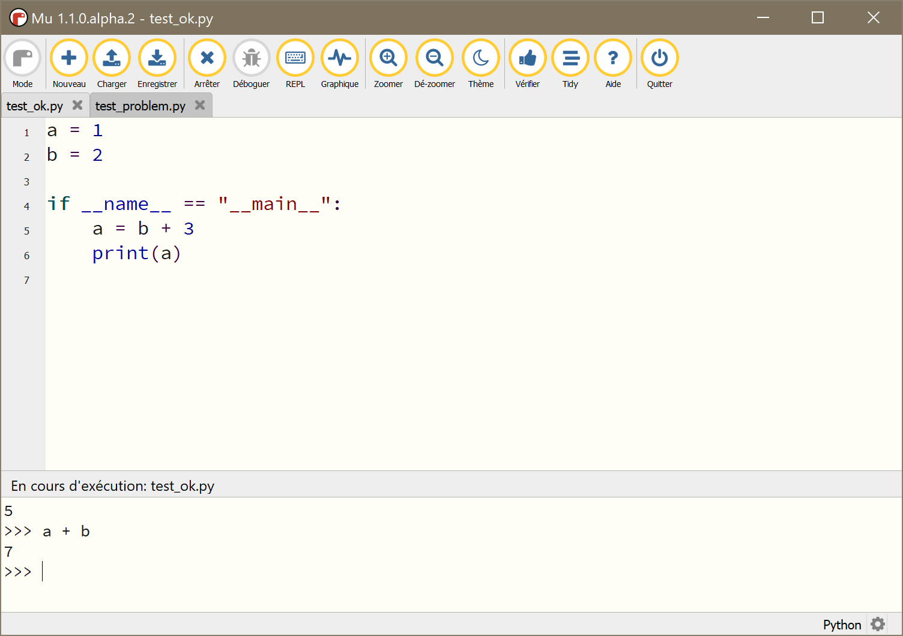
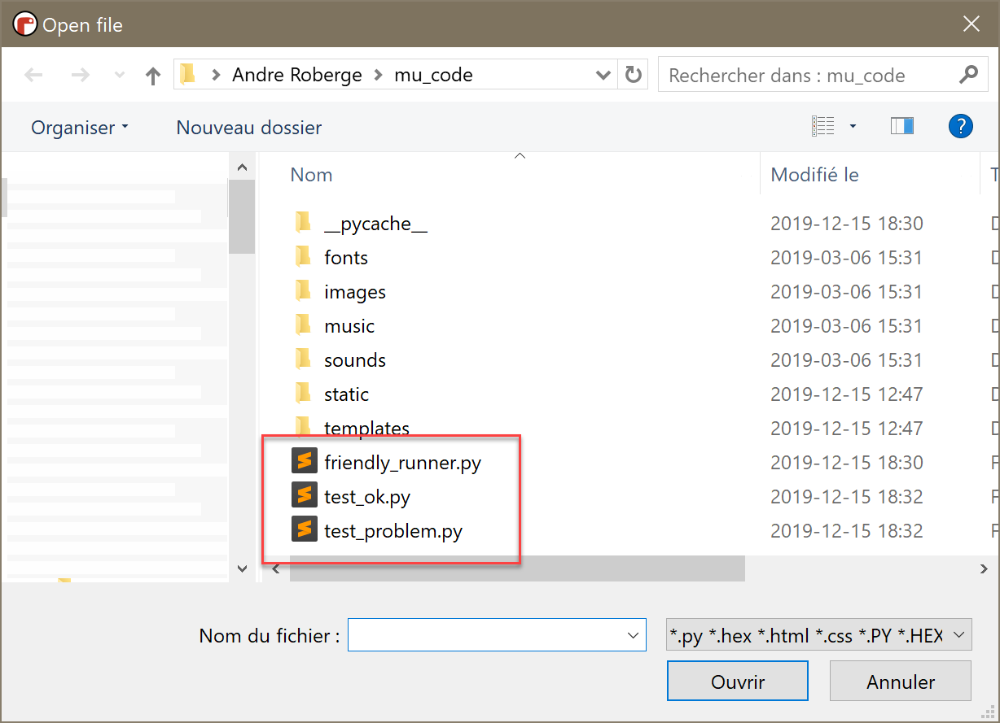

Using with Mu
=============

`Mu <https://codewith.mu/>`_ is a fantastic editor for beginners.
In the future, when Friendly-traceback is a bit more mature,
it appears very likely that Mu will incorporate
Friendly-traceback natively. 
For now, it is nonetheless possible to use
Friendly-traceback productively with Mu at the cost of writing
a 3-line program whose syntax is unfortunately not very user 
friendly. This is described below. But first, one has to 
install Friendly-traceback in Mu's environment.

Installation
------------

I assume that you have installed Mu on your computer.
Mu picks up the language to use from the computer default settings,
which explains why French appears on the screen capture below. 

After you start it, you should see a gear icon at the bottom right
corner.

.. image:: images/mu.png
   :scale: 50 %
   :alt: Mu

If you click on it, it will bring the following dialog.

.. image:: images/mu_dialog1.png
   :alt: Mu dialog

Click on the triangular "arrow" until the Third Party Packages tab is shown.

.. image:: images/mu_dialog2.png
   :alt: Mu dialog

Enter "friendly-traceback" and click "ok".  Friendly-traceback should
be installed. Version 0.0.25 or newer is required.
Note that until version 0.1 is released, Friendly-traceback is considered
pre-alpha, and anything you see in this documentation could be 
rapidly obsolete.

.. image:: images/mu_dialog3.png
   :alt: Mu dialog

Before using Friendly-traceback with Mu 
----------------------------------------

I have created two test files named respectively test_ok.py and test_problem.py.

First, I will run them with Mu on its own.  Below you can see what
happens when I run test_ok.py, and enter one more instruction in 
the interpreter.  

I've chosen this simple program as it illustrates two important 
features of running programs with Mu:

1. User programs are run as the main script ... as expected.

2. After a program terminates, the user has the opportunity to 
   continue interacting, using an interpreter fully aware of
   the value of the variables in the user's program. 

Next, I show what happens when I run test_problem.py with Mu.

.. image:: images/test_problem.png
   :scale: 50 %
   :alt: Mu running test_problem

Using Friendly-traceback with Mu
--------------------------------

To use Friendly-traceback with Mu, I need to create a program 
which is located in the same directory as the user program I wish
to run.  The name for that script can be anything, but it might
be useful to choose something that helps to identify it as 
being related to Friendly-traceback.

As mentioned before, the content of this program is only
three lines of code ... but their meaning will not be obvious.

.. image:: images/test_ok_friendly.png
   :scale: 50 %
   :alt: Mu with friendly running test_ok

Even though I am not running the user's program directly, it is 
nonetheless executed as though it was the main programs, which 
replicates the expectations created by running programs directly with Mu.
Also, the values of the variables used in that programs are
available in the interpreter (albeit with a few extra ones.)

Next, I show what happens when I run test_problem.py with Mu.
The only thing that will need to change, is the name of 
the user program.

.. image:: images/test_problem_friendly.png
   :scale: 50 %
   :alt: Mu with friendly running test_problem

As should be expected, a friendlier traceback is shown.

And, of course, I can ask Friendly-traceback to provide
explanations in French instead:

.. image:: images/test_problem_fr.png
   :scale: 50 %
   :alt: Mu with friendly running test_problem

Ideally, more languages would be supported. 
