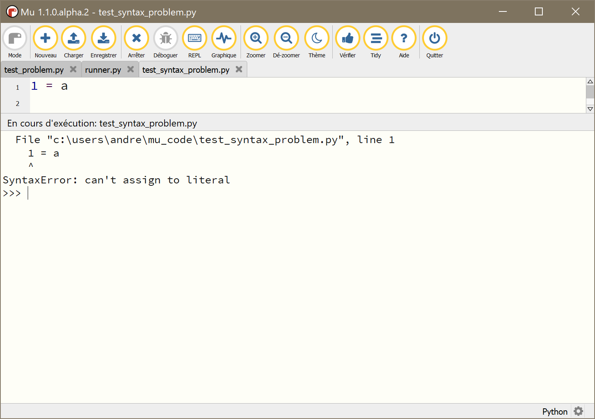
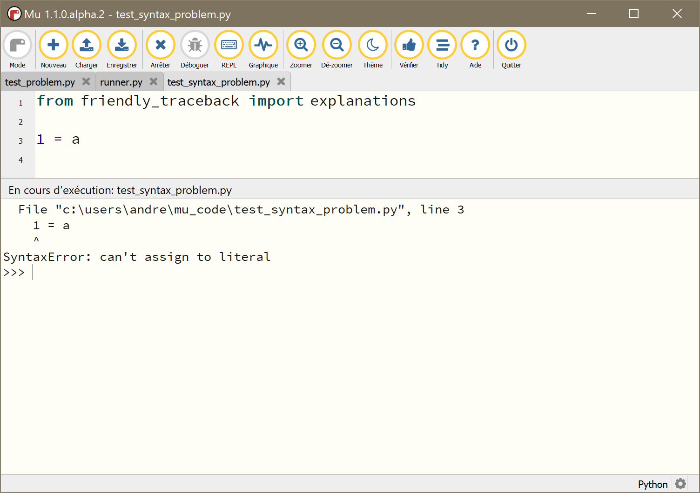
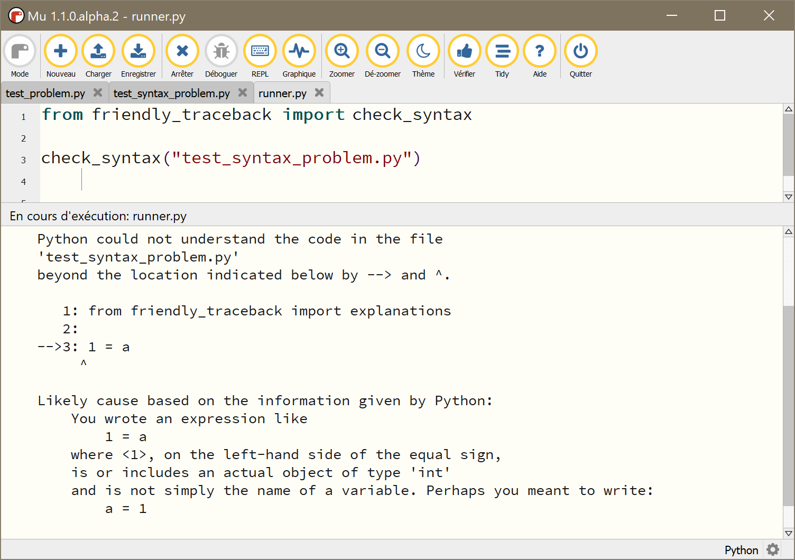
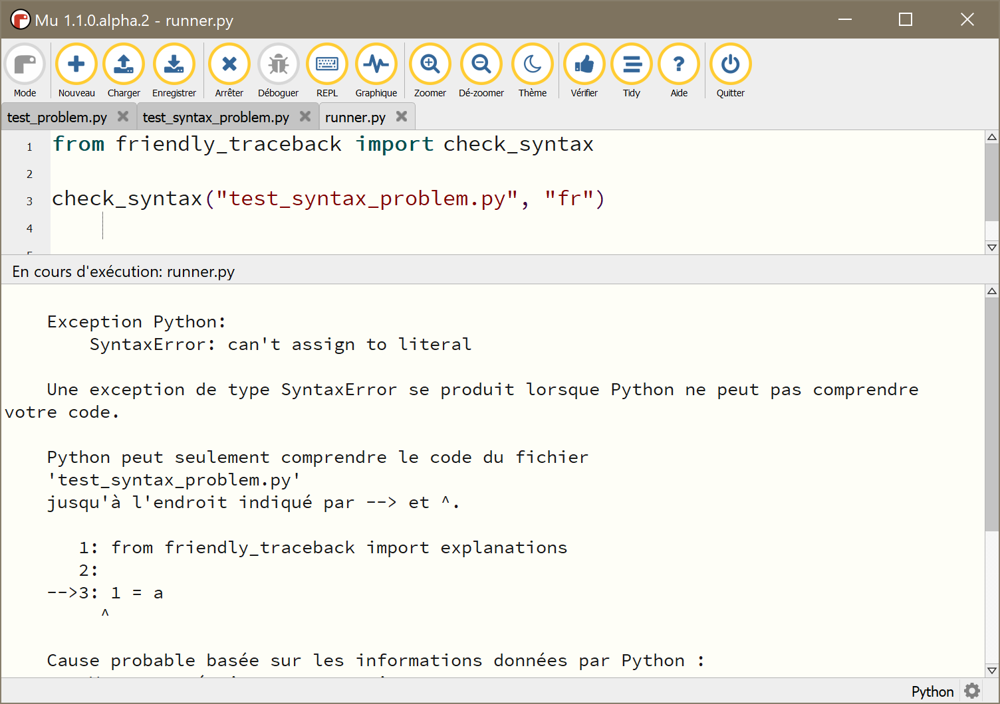

Using with Mu
=============

As mentioned previously,
`Mu <https://codewith.mu/>`_ is a fantastic editor for absolute beginners.
Its design philosophy is to enable beginners to download a single 
program that comes with everything they need to begin their programming
journey. 

In the future, when Friendly-traceback is a bit more mature,
it appears very likely that Mu will incorporate
Friendly-traceback natively. 
For now, it is nonetheless possible to use
Friendly-traceback productively with Mu by of adding 
a single line at the top of the program to be execute to catch
most exceptions. For some others, unfortunately including 
``SyntaxError`` which beginners likely encounter most frequently, 
one must do something slightly more complicated in order to benefit from 
Friendly-traceback while using Mu.

The way to do all this is described below. But first, one has to 
install Friendly-traceback in Mu's environment.

Installation
------------

I assume that you have installed Mu on your computer.
Mu picks up the language to use from the computer default settings,
which explains why French appears on the screen capture below. 

After you start it, you should see a gear icon at the bottom right
corner.

.. image:: images/mu.png
   :scale: 50 %
   :alt: Mu

If you click on it, it will bring the following dialog.

.. image:: images/mu_dialog1.png
   :alt: Mu dialog

Click on the triangular "arrow" until the Third Party Packages tab is shown.

.. image:: images/mu_dialog2.png
   :alt: Mu dialog

Enter "friendly-traceback" and click "ok".  Friendly-traceback should
be installed. Version 0.0.28 or newer is required.
Note that until version 0.1 is released, Friendly-traceback is considered
pre-alpha, and anything you see in this documentation could be 
rapidly obsolete. If somethings does not work, please do not 
hesitate to file an issue.

.. image:: images/mu_dialog3.png
   :alt: Mu dialog

Before using Friendly-traceback with Mu 
----------------------------------------

I have created a test module, called test_problem.py, that raises
and exception.
First, I show what happens when I run test_problem.py with Mu.

.. image:: images/test_problem.png
   :scale: 50 %
   :alt: Mu running test_problem

Using Friendly-traceback with Mu
--------------------------------

With the exception of ``SyntaxError`` as mentioned before,
to use Friendly-traceback with Mu, I need to add one line 
of code at the top, and run it as usual.

.. image:: images/test_problem_friendly.png
   :scale: 50 %
   :alt: Mu with friendly running test_problem

As should be expected, a friendlier traceback is shown.

.. note::

    You can copy the required line from this::

        from friendly_traceback import explanations
        
    This is equivalent to the following::

        import friendly_traceback
        friendly_traceback.install()

You likely will not be surprised to know that 
I can ask Friendly-traceback to provide explanations in French instead:

.. image:: images/test_problem_fr.png
   :scale: 50 %
   :alt: Mu with friendly running test_problem

The single line of code at the top is equivalent to the following::

    import friendly_traceback
    friendly_traceback.install(lang="fr")

Ideally, more languages would be supported. 

Dealing with ``SyntaxError``
-----------------------------

``SyntaxError`` cases can be really problematic for beginners.

Importing Friendly-traceback as described above does not help.

What one must do is create another program, and run that program 
to perform the analysis on the target. 

As usual, the default language used to provide the explanation is 
English. However, this can be changed by using an additional parameter
when calling the function. 

