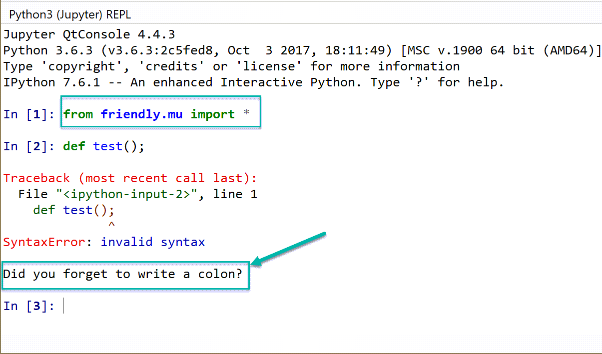
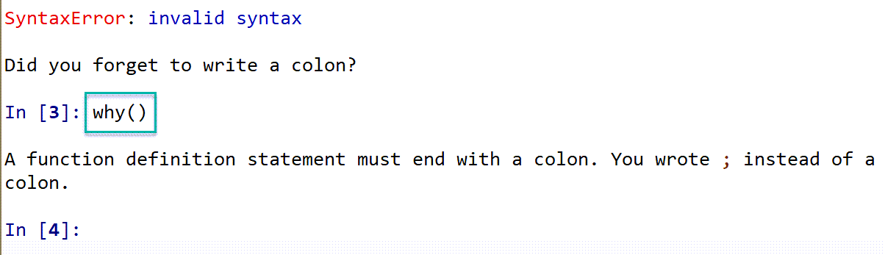
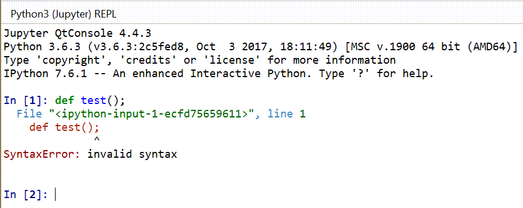

Mu's REPL
==========

Mu includes a REPL that can be started by clicking on a button
with the image of a keyboard.

To use Friendly-traceback in Mu's REPL, include the following line of code::

    from friendly_traceback.mu_repl import *

Here's what it looks like.

Future work
-----------

The REPL included in MU is known as a *Jupyter QtConsole*.
Normal tracebacks produced without using Friendly-traceback are nicely
coloured.

.. todo::

    Find a way to produce coloured output in Mu's REPL.
