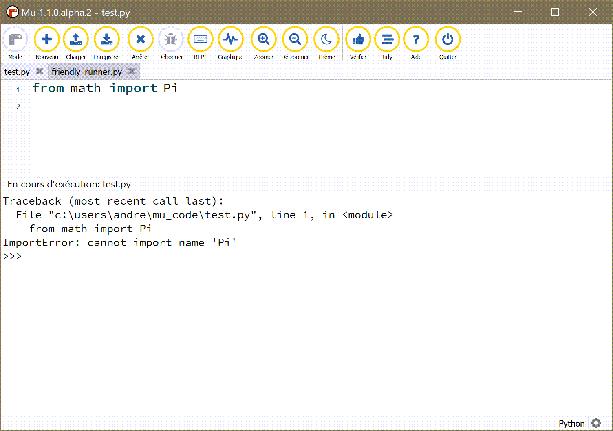
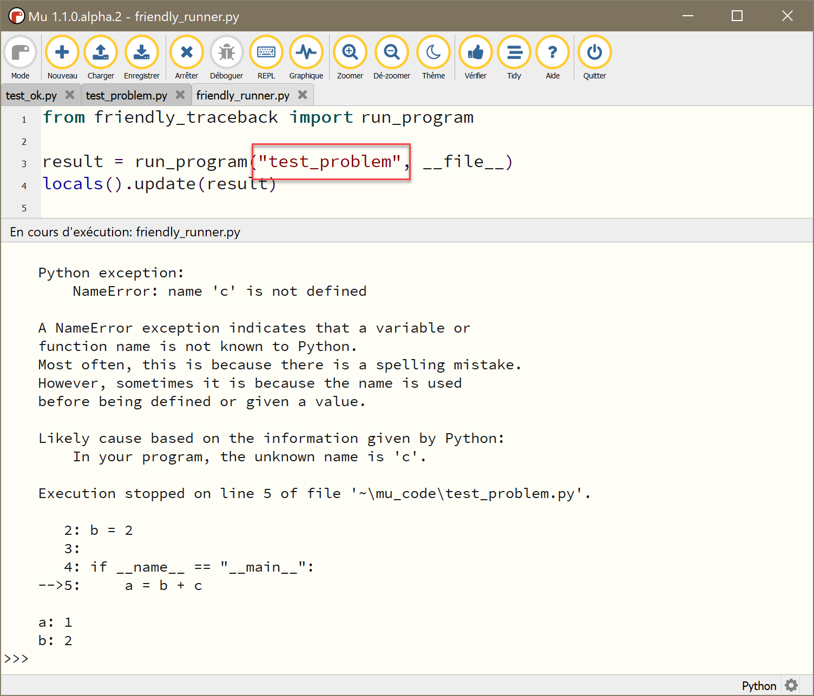
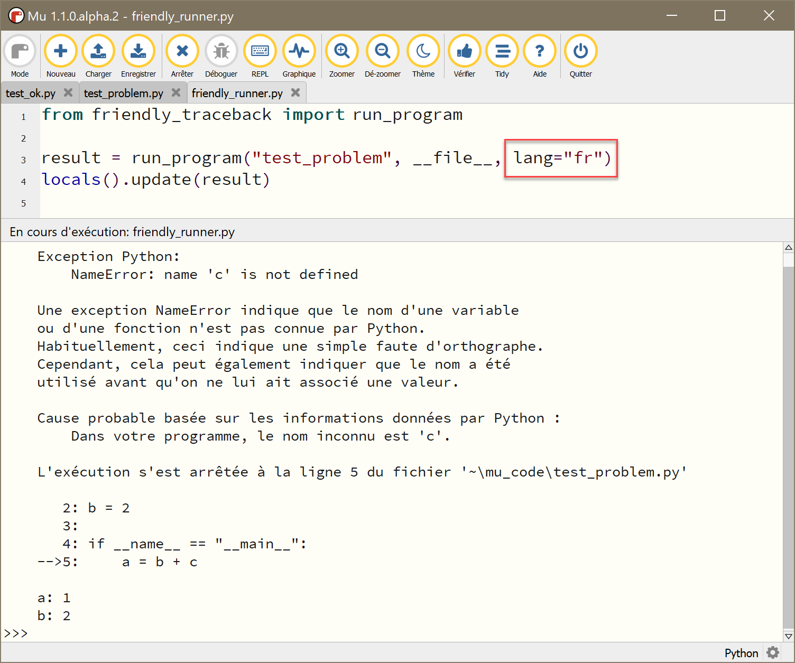

Mu: executing a program
========================

For this example, I modified my previous program named test.py
so that it raises a different exception.
First, I show what happens when I run test.py with Mu,
without friendly's help

Using friendly with Mu
--------------------------------

To use friendly with Mu when running a program in this way,
I need to use a second,
very short program, and run that program instead::

    from friendly.mu import run
    run("test.py")

As should be expected, a traceback is shown, with a hint added.
By typing ``why()`` at the prompt, friendly gives me
more information.

You likely will not be surprised to know that
I can ask friendly to provide explanations in French instead:

.. danger::

    Do not name your own program ``friendly.py``.
