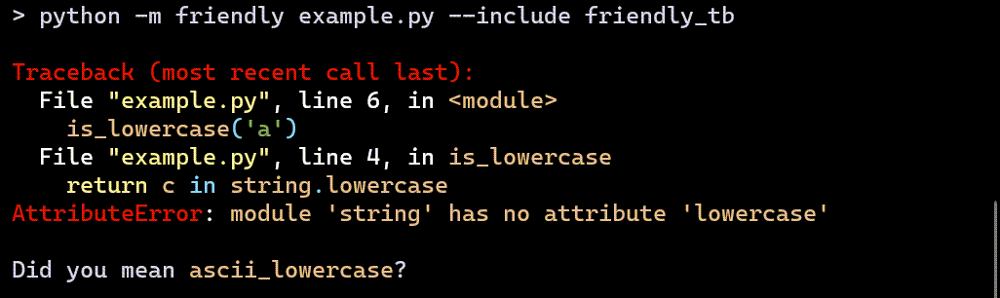
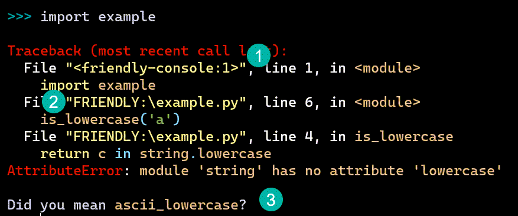
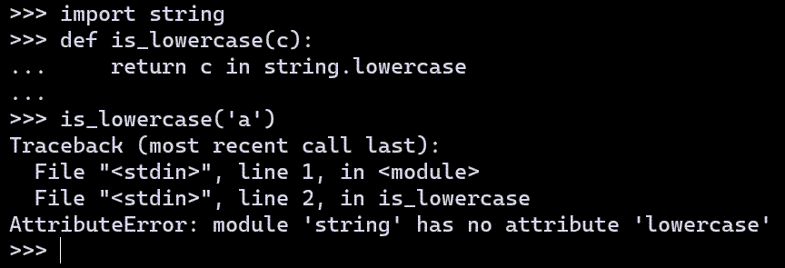

.. _multiple_tracebacks:

Multiple tracebacks
====================

.. tip::

    You might want to skip this section if it is the first time
    you read through this documentation.

In addition to providing additional information about the actual cause
of an exception, compared with a traditional traceback, the traceback
itself is formatted differently than a traditional Python traceback.
You can choose to see three different tracebacks:
``friendly_tb``, ``python_tb``, ``debug_tb``.
Of these three, ``python_tb`` is designed to reproduce fairly accurately
what would be seen if a program would be run without
friendly. In a few cases, it will have some minor differences
compared with a normal Python traceback.

In this section, I compare these three tracebacks with the normal
Python traceback in three different settings:

* Running a module from the command line.

* Importing a module.

* Writing code in the interpreter.

For the first two, the module I will run contains the following::

    import string

    def is_lowercase(c):
        return c in string.lowercase

    is_lowercase('a')

Running a module from the command line
---------------------------------------

First, I show the result of running a module containing
the code shown above using Python.

.. image:: images/tb_python1.png
   :scale: 50 %
   :alt: Screen capture showing a normal python traceback.

Next, I run the same module using friendly
showing the ``python_tb`` case; this is done using ``--include python_tb``
as a command line option.
In this particular case, the only difference with the
normal Python traceback is the addition of an empty line preceding
the traceback, with the goal of increasing readability.

.. image:: images/python_tb1.png
   :scale: 50 %
   :alt: Screen capture showing a simulated python traceback.

With the ``friendly_tb`` option, you see a "hint" added to the traceback;
in some instances, no such hint can be provided.

Finally, I use the ``debug_tb`` to show the real traceback produced
when running this example using friendly: it includes
code from friendly itself.

.. image:: images/debug_tb1.png
   :scale: 50 %
   :alt: Screen capture showing a the true traceback.

Importing a module
------------------

Let's compare what happens if I import the same module instead
from a console, starting with Python's own.

.. image:: images/tb_python2.png
   :scale: 50 %
   :alt: Screen capture showing a normal python traceback.

When doing the same with friendly, it is the ``friendly_tb``
that is shown by default. It has three differences compared with
the normal Python traceback:

1. The name of the console is different (``<friendly-console:...>`` instead of ``<stdin>``.)
2. Paths are shortened (more about this below)
3. As before, any "hint" available is automatically shown.

You can see the simulated Python traceback by entering ``python_tb()``;
as before, and except for the name of the console,
the only difference with a normal Python traceback is the addition of
an empty line preceding the traceback.

.. image:: images/python_tb2.png
   :scale: 50 %
   :alt: Screen capture showing a simulated python traceback.

Finally, you can use ``debug_tb()`` to see the complete traceback.

.. image:: images/debug_tb2.png
   :scale: 50 %
   :alt: Screen capture showing a the true traceback.

More about the friendly interpreter
---------------------------------------------

When using a normal Python interpreter, the traceback generated
includes only a list of "files" without including the actual
content of the line that was executed.

As before, when doing the same with friendly,
it is the ``friendly_tb`` that is shown by default.
It includes the line of code that was executed for each "file".

.. image:: images/friendly_tb3.png
   :scale: 50 %
   :alt: Screen capture showing a friendly traceback.

The same is true for the ``python_tb()``; I could remove this information
to make it more similar to a "true" Python traceback but I feel that
the loss of information would not be helpful.

.. image:: images/python_tb3.png
   :scale: 50 %
   :alt: Screen capture showing a simulated python traceback.

As before, I can use ``debug_tb()`` to see the complete traceback.

Since paths can be quite long, when showing information about an
exception, friendly will attempt to reduce the length
of the path shown. You've seen before an example where ``FRIENDLY``
was substituted for the name of the directory where ``friendly``
is located; this particular example will rarely be seen by an end-user.
However, sometimes ``HOME_DIR`` will be shown instead of the full
path to the user's home directory.
A much more significant reduction in length occurs when the path
for a module from the Python standard library, as shown below.

Lines suppressed: recursion example
------------------------------------

Consider the following::

    def a():
        b()

    def b():
        a()

    a()

Try running this using Python. Not only will you get a
``RecursionError`` but you'll get something like 2000 lines included.
This is not exactly user friendly.  It is also what
would be shown if I had used ``debug_tb()``. Let's skip this, and
only look at the output from the other two tracebacks, starting
with ``friendly_tb()`` which is shown by default.

.. image:: images/recursion1.png
   :scale: 50 %
   :alt: Screen capture showing lines suppressed

As a rule, and **not only** for the ``RecursionError`` cases,
the ``friendly_tb()`` default will only show a few intermediate lines
of code, to avoid filling the screen with too much information.

A similar, but not quite as extensive suppression is also done for
``python_tb()`` but **only** for ``RecursionError`` cases.

.. image:: images/recursion2.png
   :scale: 50 %
   :alt: Screen capture showing lines suppressed
