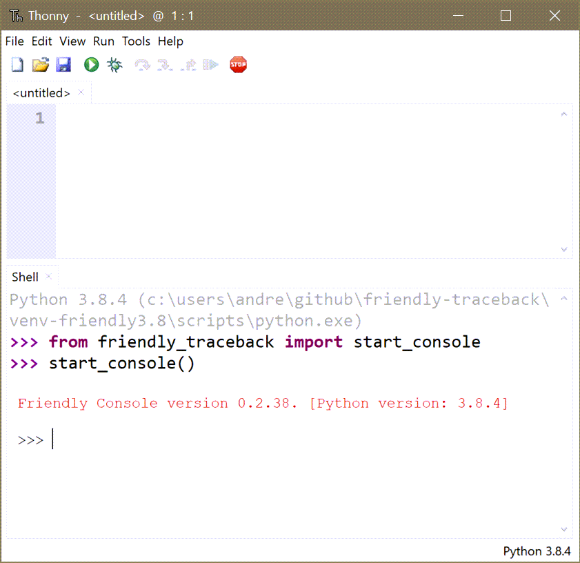

Other repl
===========

Most REPL handle tracebacks in their own ways.
When that is the case, Friendly-traceback cannot be "installed".
If you still wish to use Friendly-traceback, you can start its
console within a given REPL, using::

    >>> from friendly_traceback import start_console
    >>> start_console()

For example, here is what it looks when using Thonny:

Future work
------------

.. todo::

    Ensure that Friendly-traceback can be integrated within Thonny
    and used to supplement Thonny's own "Assistant".

.. todo::

    Determine if there would be interest in integrating Friendly-traceback
    with `ptpython <https://github.com/prompt-toolkit/ptpython>`_.
    This might perhaps be done by monkey-patching
    `_handle_exception <https://github.com/prompt-toolkit/ptpython/blob/caff15a461b64dee36c22608d36170830cafd5f3/ptpython/repl.py#L497>`_
    or by having ptpython's developer enable custom ``sys.excepthook``.
