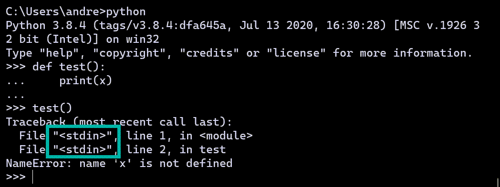
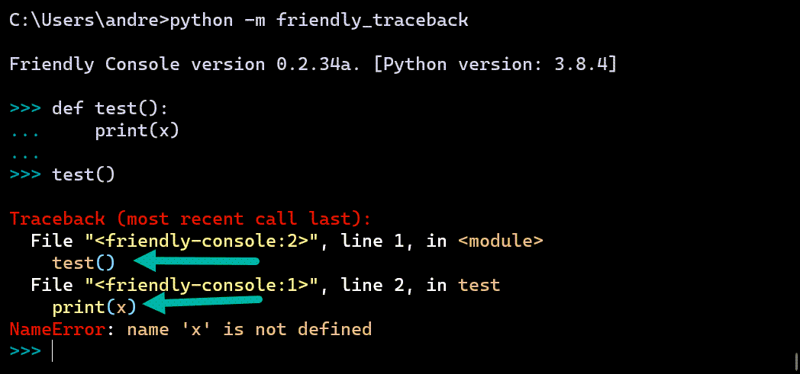
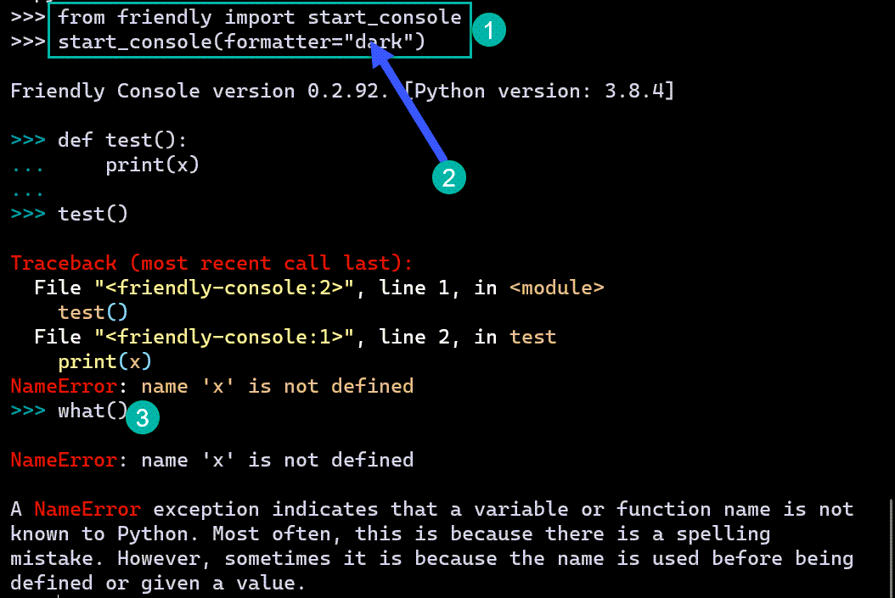

Using another REPL
===================

.. admonition:: Summary

   Depending on which REPL you are using, you will need to use
   two lines of code, which will look like the following::

        from friendly_traceback.some_version import something
        do_something()

.. sidebar:: Reminder

    A REPL (Read-Eval-Print Loop) is an interactive mode where
    we are invited to type in some Python code after a
    **prompt** (most often written as ``>>>``). Python reads
    this code, interprets what it means, and might "print" (show) some
    result before showing another prompt waiting for us to enter
    more code.

    Other synonyms of REPL are *console*, *shell*, and *interpreter*.

Many programming environments include their own REPL.
Depending on which of these we use, we can enable Friendly-traceback
in different ways.

Python's REPL
-------------

First, we compare using Python's own REPL with using the Friendly console.

Each time we enter a line of code or a block of code in a Python interpreter,
it appears to be saved in a file which is always named ``<stdin>``.
The actual code entered on a given line of each such "file" is never available.

Compare this with what happens when we use a Friendly console:

Notice how the traceback shown by Friendly-traceback includes the lines
of code that caused the problem.  To find the cause of the problems
that gave rise to a traceback, Friendly-traceback needs to have this
information.  For this reason, Friendly-traceback cannot be
"installed" in a standard Python interpreter. We can however
start a console using the following::

    from friendly_traceback import start_console
    start_console(use_rich=True)

These two lines of code are shown below (1).

For the function ``start_console``, we use the option ``use_rich=True`` (2) so
that we get the coloured output; some other REPL do not permit
to show coloured output in this way.

Since we are using the Friendly console, functions such as ``what()`` (3)
are available.

Other REPL
------------

Unlike Python's REPL, some other REPL (but not all) are designed so
that we can get the information about the lines of code which lead to
an exception. In this case, we can use these REPL directly and not
start the Friendly console using ``start_console()``. However, in order
to make sure that functions like ``what()``, ``why()``, etc., are
available, the first line of code will have to be something like::

    from friendly_traceback.some_version import *

The ``import *``, which is often not recommended, is required here so that
we can use functions like ``what()``, etc.  The alternative would be to
either list every single function required::

    from friendly_traceback.some_version import what, why, where, ...

or::

    import friendly_traceback
    ...
    friendly_traceback.what()  # when needed to use it
