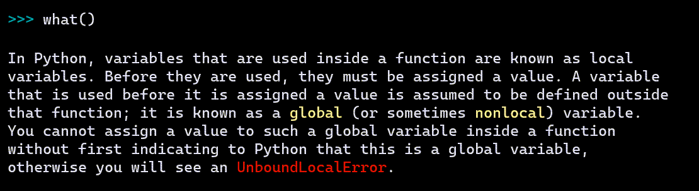

Console basics
===============

.. sidebar:: Using screenshots

    Below, we occasionnally use some screenshots, done in a Rich-friendly
    console, but we also write some examples as text so that they
    can provide the required information to people relying on screen readers.

As a rule, we do not recommend that beginners write their programs
in a console (repl) but that they use an editor instead.
However, using a console is useful to demonstrate various
features of Friendly-traceback. Furthermore, as we will see when
we discuss using Friendly-traceback with editors, knowing
the console basics here might come in handy.

what()
------

Imagine that you are a beginner. You write some code and are
suddenly confronted with the following:

.. image:: images/greet_what_1.png
   :scale: 60 %
   :alt: Screen capture of unbound local error

You see ``UnboundLocalError``, and have no idea what it might mean.
Rather than heading to StackOverflow to ask a question and have it
immediately closed as being a duplicate, you simply ask ``what()``
and Friendly-traceback tries to help you.

``what()`` only gives here some generic information about what an ``UnboundLocalError`` is.
Later, we'll see how Friendly-traceback can often give more useful
information regarding the exact cause of the exception, and how to fix it.

``what()`` can be useful even if an exception has not been raised.
In principle, you can get information about any exception by passing it as
an object::

    >>> what(IndexError)

    An IndexError occurs when you are try to get an item from a list, a tuple, or a similar
    object (sequence), by using an index which does not exists; typically, this is because
    the index you give is greater than the length of the sequence. Reminder: the first item
    of a sequence is at index 0.

Instead of using a known Exception object, we can pass its name as a string
if we prefer. We can even specify a language other than English ...
as long as it is French - hopefully, support for more languages will be added
by contributors::

    >>> what("IndentationError", lang='fr')

    Une exception de type IndentationError se produit lorsqu'une ligne de code n'est pas
    indentée (c'est-à-dire alignée verticalement avec les autres lignes) de la façon
    attendue.

.. sidebar:: French?

    Currently, language selection has to be done "globally",
    except for ``what()`` as shown here.

.. todo:: Try to provide such generic information about **all** standard Python exceptions.

why()
-------

You are a beginner reading some code found in a tutorial on the web
and decide to try it out by copy-pasting it.

.. image:: images/why_1.png
   :scale: 60 %
   :alt: Screen capture of syntax error

So, this didn't work, but you'd like to find out why -- and possibly
how to fix the problem.

    >>> why()
    Python indicates that you used some unicode characters not allowed as part
    of a variable name; this includes many emojis. However, I suspect that you
    used a fancy unicode quotation mark instead of a normal single or double
    quote for a string. This can happen if you copy-pasted code.

where()
-------

Python traceback give information about where an exception was raised and
more. But it does so in a way that's not entirely friendly to users.
Let's look at a different example, and see how Friendly-traceback
can give a bit more information about the location of the problem.

.. code-block:: python

    >>> test_4()

    Traceback (most recent call last):
      File "<friendly-console:4>", line 1, in <module>
        test_4()
      File "<friendly-console:3>", line 2, in test_4
        test_2()
      File "<friendly-console:2>", line 2, in test_2
        test_1(3)
      File "<friendly-console:1>", line 2, in test_1
        x += y
    NameError: name 'y' is not defined

This might be confusing to a beginner. Let's see if we can
give a bit more information about where the error occurred::

    >>> where()

    Execution stopped on line 1 of file '<friendly-console:4>'.

        -->1: test_4()

        Known objects shown above:

        test_4: <function test_4>

    Exception raised on line 2 of file '<friendly-console:1>'.

           1: def test_1(x):
        -->2:     x += y
           3:

        Known objects shown above:

        global test_1: <function test_1>
        x: 3

Friendly-traceback gives detailed information about two locations
at most: where the program stopped and where the exception was
raised. It shows a few lines of code near the source of the problem,
and gives some information about each identifier appearing
on these lines of code.

explain()
---------

Sometimes, it might make sense to show all the available information at
once. This is what ``explain()`` does. Let's illustrate it with
a screen capture.

.. image:: images/explain.png
   :scale: 50 %
   :alt: Screen capture illustrating the use of explain()

``explain()`` shows everything: a friendly traceback with an
added ``hint()`` (more on this later), as well as the output of
``what()``, ``where()`` and ``why()``.

more()
------

After a while, users do not need to see the display of ``what()`` as
they have learned to recognize most exceptions. However, after
seeing a traceback, they might want to see more information
about ``where()`` and ``why()``: this is what ``more()`` does.

We purposely do not show an example, and leave it up to you to try!

More about explain()
--------------------

``explain()`` is a bit more versatile than we let it on: it can
take an argument that can change its behaviour.
For example, ``explain("what")`` is equivalent to ``what()``;
``explain("why")`` is equivalent to ``why()``.
For the console, this is clearly redundant. However, it is something
to keep in mind as it might be more useful later.
