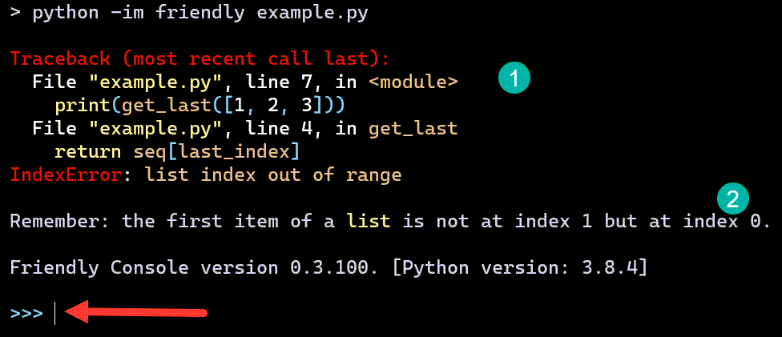

.. _using_repl:

Console basics
===============

As a rule, I do not recommend that beginners write their programs
in a console (REPL) but that they use an editor instead or a
notebook environment as it is easier to edit and correct mistakes.
However, using a console is useful to demonstrate various
features of friendly which can be made available
in many editor/IDE environments.
Furthermore, the combination of using an editor and a console
can be quite useful.

The example I will be using is the same as the one shown on the
first page of this documentation: I have a file with the
following content::

    # example.py
    def get_last(seq):
        last_index = len(seq)
        return seq[last_index]

    print(get_last([1, 2, 3]))

However, instead of using::

    python -m friendly example.py

to run this file, I will add an additional ``i`` flag so that ``-m`` become ``-im``;
as a result, a friendly console will be available after the program ends
so that we can execute more Python commands.

In the image above, the red arrow points to the the interactive prompt
where we can type more command. the part identified by (1) is essentially the normal Python traceback. Depending on how long it gets, it can get shortened
by friendly as is explained later [:ref:`multiple_tracebacks`].

Part (2) is a "hint" **occasionally** provided by friendly and which
can be useful in identifying the cause of the problem. You will see
shortly how to get friendly to give additional information
as to the possible cause of this error.

Let's do this again but choosing French as the default language
with the ``--lang fr`` option: this will
help to better identify various parts and compare what information
is obtained from Python (as it won't be translated) and what additional
information is provided by friendly.

.. image:: images/friendly_interactive_indexerror_fr.png
   :scale: 60 %
   :alt: friendly IndexError interactive example in French

