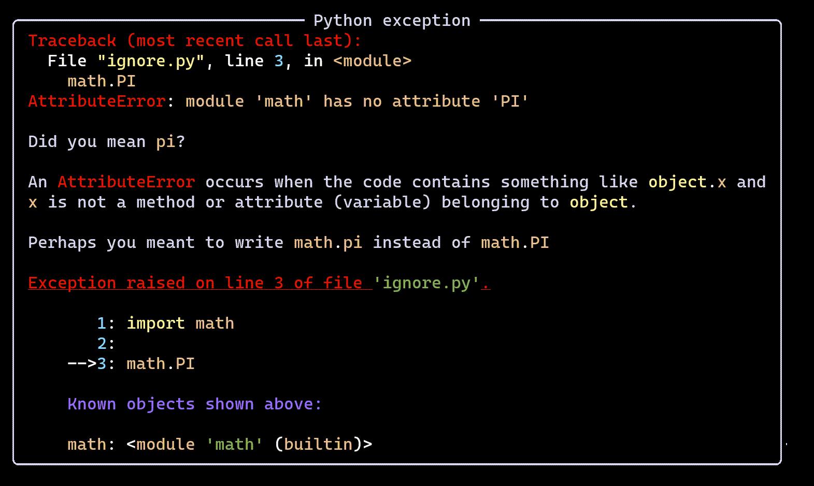
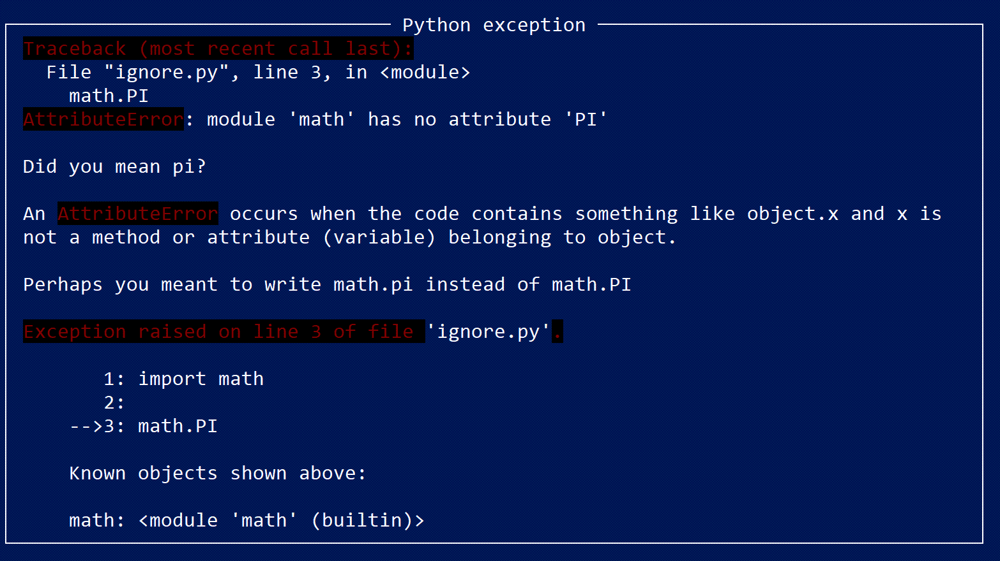
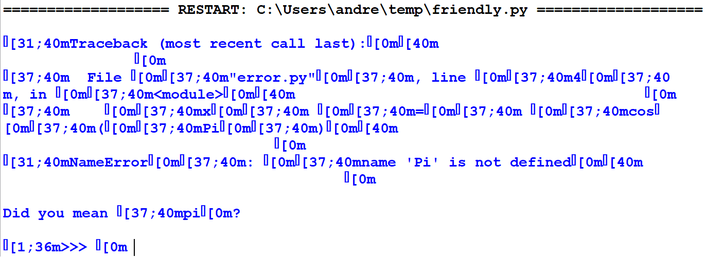

.. _themes:

Themes and colours
===================

As mentioned before, Friendly can make use of
`Rich <https://github.com/willmcgugan/rich>`_ if it is installed.
Syntax colouring is done by Rich using Pygments.
While Pygments comes with many different styles (colour schemes),
most of them do not define colours for all possible parts of
a Python traceback: depending on the style, we sometimes end up with
some text with the same colour as the background.

To ensure that all of Friendly's output would be styled
properly, Friendly includes its own "theme".
One problem I had was to figure out
all the possible styling elements. It turned out that I had "solved"
this problem in 2008 when I created the Pygments Tango style for
an old project of mine (Crunchy, done with Johannes Woolard)
where I did my best to include all
possible styling elements, while minimizing the numbers of colours
used. While Tango had been designed for a light coloured background,
the new style has been designed for a dark coloured background.

Designing a pygments colour style is one thing; having it faithfully
displayed in a terminal is something else altogether.
Below you will see various screenshots: the first one is
taken using the new `Windows Terminal <https://github.com/microsoft/terminal>`_.
Other screenshots have been taken using `ConEmu <https://conemu.github.io/>`_,
using different colour schemes available from ConEmu's settings.
Much to my surprise, even though the colours I have chosen are not standard
colours, they are much altered by ConEmu depending on the chosen
colour scheme.

Friendly default theme using Windows Terminal
--------------------------------------------------------

ConEmu: base16 theme
--------------------

.. image:: images/conemu_base16.png
   :scale: 40 %
   :alt: ConEmu: base16 theme

ConEmu: default windows theme
-----------------------------

.. image:: images/conemu_default_windows.png
   :scale: 40 %
   :alt: ConEmu: default windows theme

ConEmu: powershell theme
-----------------------------

Other OS
--------

Screenshots taken by MacOS or Linux users would be welcome.

Rich not supported
-------------------

Rich works by adding escape sequences which are interpreted
by terminals as adding style (colours, font style like bold, italics, or
underlined, etc.). Some environment cannot interpret these escape
sequences. Here is what happens if we attempt to use Rich
together with Python's IDLE:

Conclusion
-----------

While suggestions for improving Friendly are generally
always welcome, suggested changes to the current default theme
will likely be ignored since the end result appear to be
completely dependent on the environment.

I might consider supporting custom themes, but this will likely
be a lower priority item.
