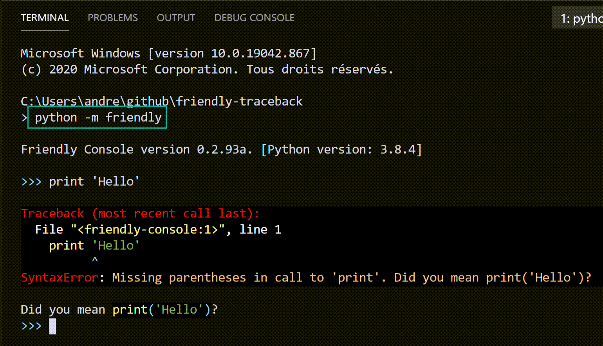
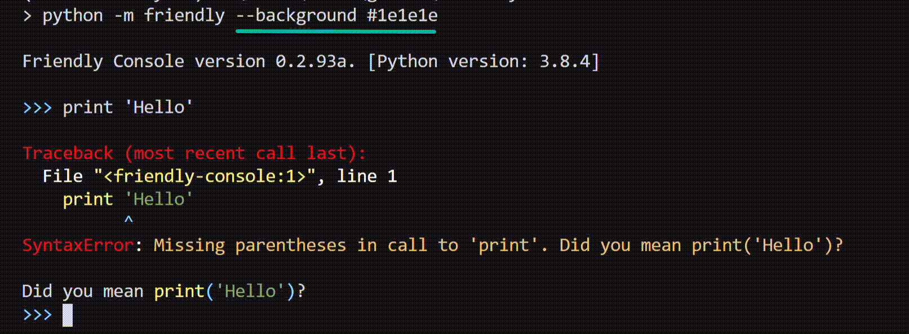

Visual Studio Code's terminal
===============================

You can start the friendly console in Visual Studio Code's terminal
in the same way as mentioned before::

    python -m friendly

This is designed for a dark coloured terminal; the closer the
background to your chosen VS code theme is to black, the
better it likely will look. For the theme we use, the background
colour is #1e1e1e instead of pure black (#000000).
It is however possible to specify a background
colour to use, with:

.. code-block:: none

    python -m friendly --background #1e1e1e

If you use a light coloured theme, you should use the
following instead:

    python -m friendly --formatter light

And here is the result:

Just like in the previous case, you could specify a background colour
of your choice.
