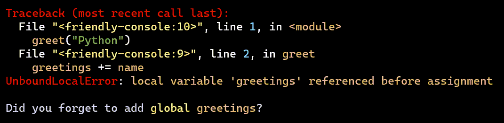
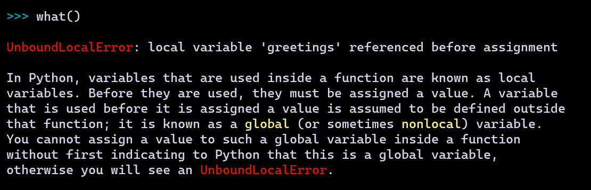

what()
======

Imagine that you are a beginner. You write some code and are
suddenly confronted with the following:

You see ``UnboundLocalError``, and have no idea what it might mean,
in spite of the hint provided by friendly.
Rather than heading to StackOverflow to ask a question and have it
immediately closed as being a duplicate, you simply ask ``what()``
and friendly tries to help you.

``what()`` only gives here some generic information about what an ``UnboundLocalError`` is.
Later, you will see how friendly can often give more useful
information regarding the exact cause of the exception, and how to fix it.

``what()`` can be useful even if an exception has not been raised.
In principle, you can get information about any exception by passing it as
an object::

    >>> what(IndexError)

    An IndexError occurs when you are try to get an item from a list, a tuple, or a similar
    object (sequence), by using an index which does not exists; typically, this is because
    the index you give is greater than the length of the sequence. Reminder: the first item
    of a sequence is at index 0.

Instead of using a known Exception object, you can pass its name as a string
if you prefer. You can even specify a language other than English ...
as long as it is French - hopefully, support for more languages will be added
by contributors::

    >>> set_lang('fr')
    >>> what("IndentationError")

    Une exception de type IndentationError se produit lorsqu'une ligne de code n'est pas
    indentée (c'est-à-dire alignée verticalement avec les autres lignes) de la façon
    attendue.

