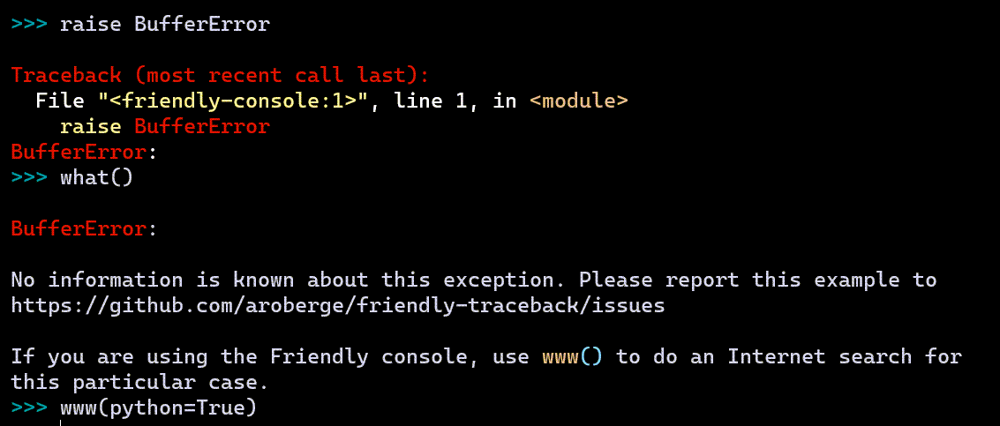
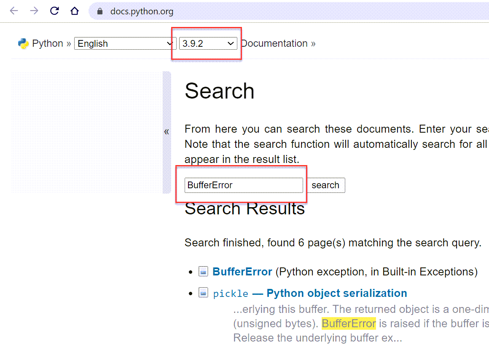

what()
======

Imagine that you are a beginner. You write some code and are
suddenly confronted with the following:

You see ``UnboundLocalError``, and have no idea what it might mean,
in spite of the hint provided by Friendly.
Rather than heading to StackOverflow to ask a question and have it
immediately closed as being a duplicate, you simply ask ``what()``
and Friendly tries to help you.

.. image:: images/greet_what_2.png
   :scale: 60 %
   :alt: Screen capture of explanation about unbound local error

``what()`` only gives here some generic information about what an ``UnboundLocalError`` is.
Later, you will see how Friendly can often give more useful
information regarding the exact cause of the exception, and how to fix it.

``what()`` can be useful even if an exception has not been raised.
In principle, you can get information about any exception by passing it as
an object::

    >>> what(IndexError)

    An IndexError occurs when you are try to get an item from a list, a tuple, or a similar
    object (sequence), by using an index which does not exists; typically, this is because
    the index you give is greater than the length of the sequence. Reminder: the first item
    of a sequence is at index 0.

Instead of using a known Exception object, you can pass its name as a string
if you prefer. You can even specify a language other than English ...
as long as it is French - hopefully, support for more languages will be added
by contributors::

    >>> set_lang('fr')
    >>> what("IndentationError")

    Une exception de type IndentationError se produit lorsqu'une ligne de code n'est pas
    indentée (c'est-à-dire alignée verticalement avec les autres lignes) de la façon
    attendue.

www(python=True)
------------------

You will occasionally see errors that are not known by Friendly.
Here's an example:

Notice how I entered the command ``www(python=True)`` at the end:
this resulted in opening a web browser and doing
a search in the online Python documentation for the name of the most recent
exception raised.

The search will always be done on the most recent Python version
(3.9.2 in the above). If this is not the version you are using, you
can select the correct one from the dropdown selector at the top
of the Python documentation page.
If I had set the language to French instead of
English [which could have been done with ``set_lang('fr')``], the search
would have been done in the French version of the Python documentation.
