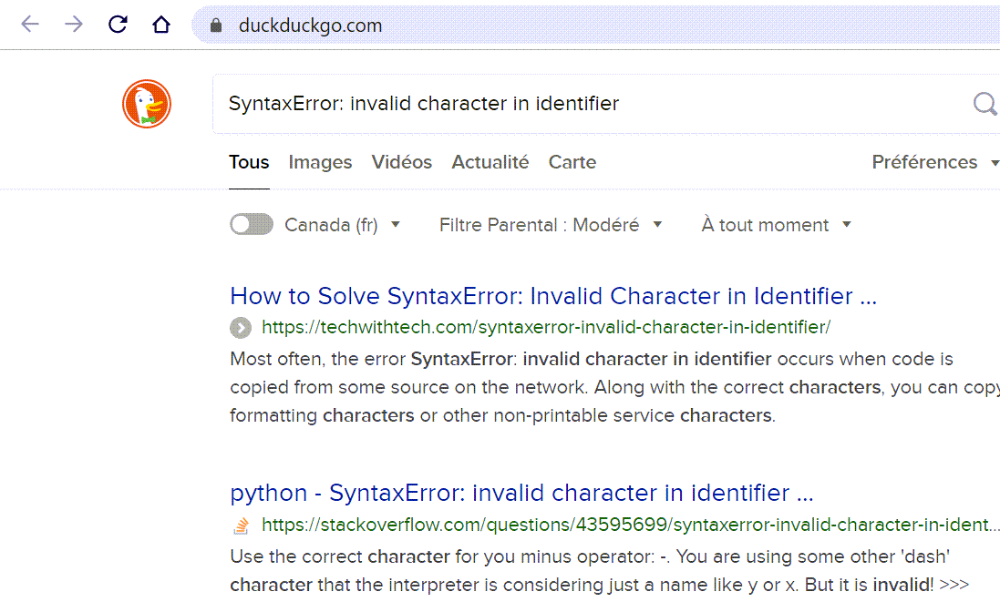

www()
=======

Occasionally, friendly will not recognize an exception,
or a given message associated with that exception::

    SomeError: never seen before

In this case, you can use the function ``www()`` which will open
your default web browser and do an internet search for
``"SomeError: never seen before"`` using DuckDuckGo.

The same is true if you find that the explanation given by **friendly**
is not enough for you.

If no exception has been raised, calling ``www()`` will open
**friendly**'s documentation instead.

Optional arguments
------------------

``www()`` is a convenience function that uses Python's webbrowser
module to open a page in the default web browser.
It can also take one of the following optional arguments:

- ``www('friendly')``: go to **friendly**'s documentation site.

- ``www('python')``: go to Python's documentation site for the Python
  version currently used by the program from which it is invoked.

- ``www('bug')``: go to the Github's issue page for **friendly**.

- ``www('email')``: uses the default browser configuration to invoke
  an email app to start a new email to be sent to me
  (andre.roberge@gmail.com). If you do not have a Github account,
  you can definitely use this option to communicate with me.

All string arguments passed to ``why()`` are case-insensitive.

Note that ``www()`` is a recent addition to friendly and that
its behaviour is subject to change based on received feedback.
